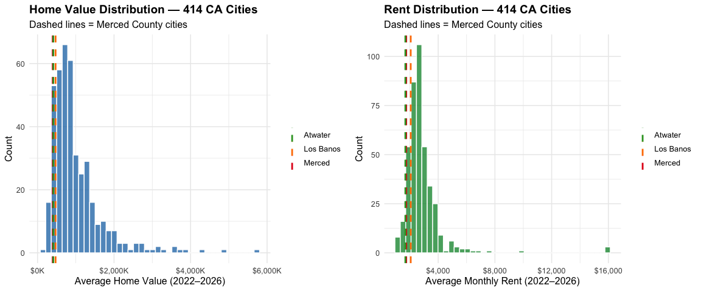
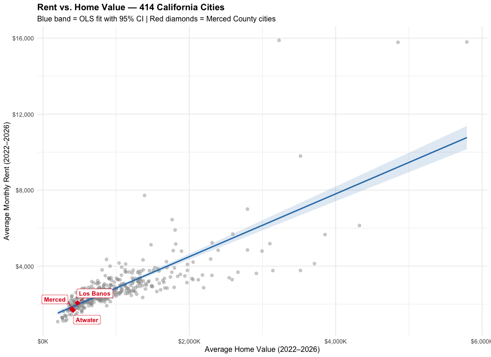
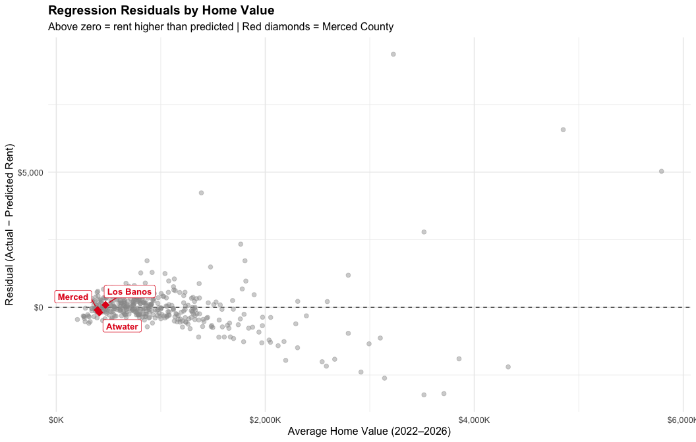
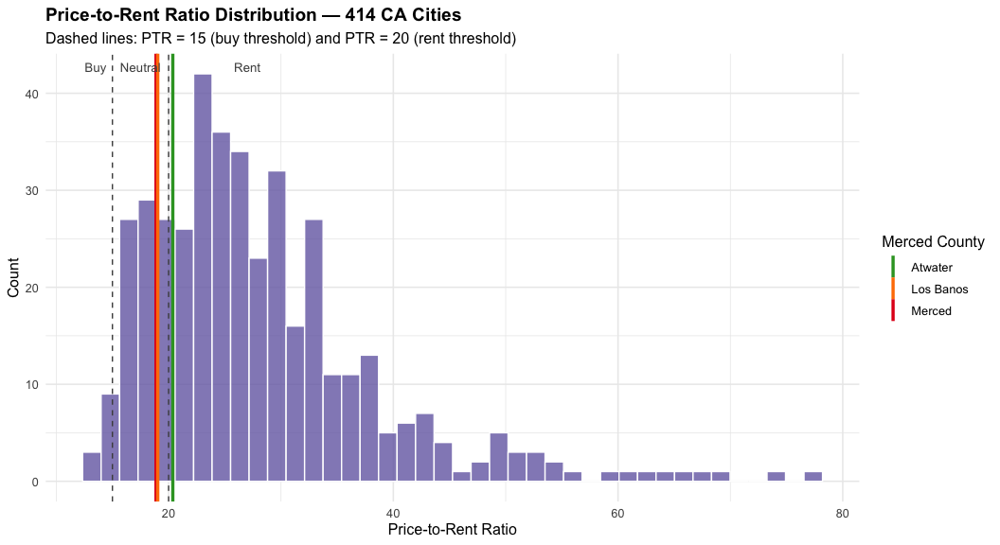

California Rent vs. Home Value Regression
================
05/11/26

# What Drives Rent in California?

A Regression Analysis of 414 Cities — and Where Merced County Fits

## Project Overview

California’s housing market spans extremes: \$200k Central Valley
starter homes and \$3M Bay Area condos occupying the same state. But
does rent track home values linearly across all cities? And where do
small inland cities like Merced and Los Banos fall relative to that
statewide trend?

This project applies linear regression to Zillow ZHVI (home values) and
ZORI (rental index) data for **414 California cities**, using 2022–2026
averages where both datasets are available. The goal is to quantify the
rent-to-home-value relationship and identify which cities are over- or
under-priced relative to what their home values would predict.

**Merced County cities — Merced, Los Banos, and Atwater — serve as the
focal case study.**

**Data:** Zillow ZHVI City-level home values (2022–2026 avg) + ZORI
City-level rent index (2022–2026 avg) \| 414 CA cities with both
datasets.

------------------------------------------------------------------------

## I. Environment Setup and Data Loading

``` r
library(tidyverse)
library(ggplot2)
library(broom)
library(scales)
library(ggrepel)

df <- read_csv("ca_cities_housing.csv") %>%
  mutate(merced_county = CountyName == "Merced County",
         county_label  = ifelse(merced_county, RegionName, NA_character_))

cat("Cities loaded:", nrow(df), "\n")
```

    ## Cities loaded: 414

``` r
cat("CA avg home value: $", comma(round(mean(df$avg_home_value))), "\n")
```

    ## CA avg home value: $ 1,002,181

``` r
cat("CA avg rent:       $", comma(round(mean(df$avg_rent))), "\n")
```

    ## CA avg rent:       $ 2,850

``` r
cat("CA avg price-to-rent ratio:", round(mean(df$price_to_rent), 1), "\n")
```

    ## CA avg price-to-rent ratio: 28.1

``` r
cat("\nMerced County cities:\n")
```

    ## 
    ## Merced County cities:

``` r
df %>%
  filter(merced_county) %>%
  select(RegionName, avg_home_value, avg_rent, price_to_rent, gross_yield) %>%
  mutate(across(where(is.numeric), ~round(., 1))) %>%
  print()
```

    ## # A tibble: 3 × 5
    ##   RegionName avg_home_value avg_rent price_to_rent gross_yield
    ##   <chr>               <dbl>    <dbl>         <dbl>       <dbl>
    ## 1 Merced            395729.    1747.          18.9         5.3
    ## 2 Los Banos         471185.    2063           19           5.3
    ## 3 Atwater           411872.    1685.          20.4         4.9

------------------------------------------------------------------------

## II. Exploratory Overview

### Home Value and Rent Distributions Across CA

``` r
p1 <- ggplot(df, aes(x = avg_home_value)) +
  geom_histogram(bins = 40, fill = "#2c7bb6", alpha = 0.8, color = "white") +
  geom_vline(data = filter(df, merced_county),
             aes(xintercept = avg_home_value, color = RegionName),
             linewidth = 1, linetype = "dashed") +
  scale_x_continuous(labels = dollar_format(scale = 1e-3, suffix = "K")) +
  scale_color_manual(values = c("Merced" = "#e31a1c", "Los Banos" = "#ff7f00",
                                "Atwater" = "#33a02c")) +
  labs(title = "Home Value Distribution — 414 CA Cities",
       subtitle = "Dashed lines = Merced County cities",
       x = "Average Home Value (2022–2026)", y = "Count", color = NULL) +
  theme_minimal(base_size = 12) +
  theme(plot.title = element_text(face = "bold"))

p2 <- ggplot(df, aes(x = avg_rent)) +
  geom_histogram(bins = 40, fill = "#1a9641", alpha = 0.8, color = "white") +
  geom_vline(data = filter(df, merced_county),
             aes(xintercept = avg_rent, color = RegionName),
             linewidth = 1, linetype = "dashed") +
  scale_x_continuous(labels = dollar_format()) +
  scale_color_manual(values = c("Merced" = "#e31a1c", "Los Banos" = "#ff7f00",
                                "Atwater" = "#33a02c")) +
  labs(title = "Rent Distribution — 414 CA Cities",
       subtitle = "Dashed lines = Merced County cities",
       x = "Average Monthly Rent (2022–2026)", y = "Count", color = NULL) +
  theme_minimal(base_size = 12) +
  theme(plot.title = element_text(face = "bold"))

gridExtra::grid.arrange(p1, p2, ncol = 2)
```

<!-- -->

------------------------------------------------------------------------

## III. Regression Analysis — Rent ~ Home Value

### Does rent track home values linearly across California?

``` r
model <- lm(avg_rent ~ avg_home_value, data = df)

cat("Linear Regression: Rent ~ Home Value\n\n")
```

    ## Linear Regression: Rent ~ Home Value

``` r
print(summary(model))
```

    ## 
    ## Call:
    ## lm(formula = avg_rent ~ avg_home_value, data = df)
    ## 
    ## Residuals:
    ##     Min      1Q  Median      3Q     Max 
    ## -3235.2  -303.6   -32.8   251.6  9359.7 
    ## 
    ## Coefficients:
    ##                 Estimate Std. Error t value Pr(>|t|)    
    ## (Intercept)    1.194e+03  7.804e+01   15.30   <2e-16 ***
    ## avg_home_value 1.653e-03  6.421e-05   25.74   <2e-16 ***
    ## ---
    ## Signif. codes:  0 '***' 0.001 '**' 0.01 '*' 0.05 '.' 0.1 ' ' 1
    ## 
    ## Residual standard error: 898.1 on 412 degrees of freedom
    ## Multiple R-squared:  0.6165, Adjusted R-squared:  0.6156 
    ## F-statistic: 662.3 on 1 and 412 DF,  p-value: < 2.2e-16

``` r
tidy(model, conf.int = TRUE) %>%
  mutate(across(where(is.numeric), ~round(., 6))) %>%
  knitr::kable(caption = "OLS Coefficients: Rent ~ Home Value")
```

| term           |    estimate | std.error | statistic | p.value |    conf.low |   conf.high |
|:---------------|------------:|----------:|----------:|--------:|------------:|------------:|
| (Intercept)    | 1193.866212 | 78.036773 |  15.29876 |       0 | 1040.466316 | 1347.266107 |
| avg_home_value |    0.001653 |  0.000064 |  25.73557 |       0 |    0.001526 |    0.001779 |

OLS Coefficients: Rent ~ Home Value

**Interpretation:**

- The intercept tells us the predicted rent for a city with \$0 home
  value (statistical baseline, not meaningful in isolation).
- The slope tells us how much rent increases per \$1 increase in home
  value.
- R² tells us what fraction of rent variation is explained by home
  values alone.

------------------------------------------------------------------------

## IV. Regression Scatter — All 414 Cities

``` r
merced_df <- filter(df, merced_county)

ggplot(df, aes(x = avg_home_value, y = avg_rent)) +
  geom_point(aes(color = merced_county), alpha = 0.45, size = 2) +
  geom_smooth(method = "lm", se = TRUE, color = "#2c7bb6", linewidth = 1,
              fill = "#2c7bb6", alpha = 0.15) +
  geom_point(data = merced_df, color = "#e31a1c", size = 4, shape = 18) +
  geom_label_repel(data = merced_df,
                   aes(label = RegionName),
                   color = "#e31a1c", fontface = "bold", size = 3.5,
                   box.padding = 0.5, point.padding = 0.3) +
  scale_x_continuous(labels = dollar_format(scale = 1e-3, suffix = "K")) +
  scale_y_continuous(labels = dollar_format()) +
  scale_color_manual(values = c("FALSE" = "gray60", "TRUE" = "#e31a1c"),
                     guide = "none") +
  labs(title = "Rent vs. Home Value — 414 California Cities",
       subtitle = "Blue band = OLS fit with 95% CI | Red diamonds = Merced County cities",
       x = "Average Home Value (2022–2026)",
       y = "Average Monthly Rent (2022–2026)") +
  theme_minimal(base_size = 12) +
  theme(plot.title = element_text(face = "bold"))
```

    ## `geom_smooth()` using formula = 'y ~ x'

<!-- -->

------------------------------------------------------------------------

## V. Residual Analysis — Over and Under-Priced Cities

### Which cities charge more rent than their home values predict?

A positive residual means rent is **higher than expected** given home
value (landlord-favorable market). A negative residual means rent is
**lower than expected** (renter-favorable, or possibly lower quality of
life factors suppressing demand).

``` r
df <- df %>%
  mutate(predicted_rent = predict(model, .),
         residual       = avg_rent - predicted_rent,
         pct_deviation  = residual / predicted_rent * 100)

cat("Most overpriced (rent >> what home values predict):\n")
```

    ## Most overpriced (rent >> what home values predict):

``` r
df %>% arrange(desc(residual)) %>%
  select(RegionName, CountyName, avg_home_value, avg_rent, predicted_rent, pct_deviation) %>%
  mutate(across(where(is.numeric), ~round(., 0))) %>%
  head(10) %>% knitr::kable()
```

| RegionName | CountyName | avg_home_value | avg_rent | predicted_rent | pct_deviation |
|:---|:---|---:|---:|---:|---:|
| Malibu | Los Angeles County | 3225924 | 15885 | 6525 | 143 |
| Montecito | Santa Barbara County | 4851320 | 15781 | 9211 | 71 |
| Los Altos Hills | Santa Clara County | 5792170 | 15798 | 10766 | 47 |
| Indian Wells | Riverside County | 1388072 | 7721 | 3488 | 121 |
| Del Mar | San Diego County | 3519139 | 9794 | 7010 | 40 |
| Saint Helena | Napa County | 1764991 | 6448 | 4111 | 57 |
| Rancho Mirage | Riverside County | 868430 | 4351 | 2629 | 66 |
| Coto de Caza | Orange County | 1805833 | 5900 | 4178 | 41 |
| Topanga | Los Angeles County | 1476133 | 5125 | 3633 | 41 |
| Valley Center | San Diego County | 917075 | 4000 | 2709 | 48 |

``` r
cat("Most underpriced (rent << what home values predict):\n")
```

    ## Most underpriced (rent << what home values predict):

``` r
df %>% arrange(residual) %>%
  select(RegionName, CountyName, avg_home_value, avg_rent, predicted_rent, pct_deviation) %>%
  mutate(across(where(is.numeric), ~round(., 0))) %>%
  head(10) %>% knitr::kable()
```

| RegionName | CountyName | avg_home_value | avg_rent | predicted_rent | pct_deviation |
|:---|:---|---:|---:|---:|---:|
| Palo Alto | Santa Clara County | 3518549 | 3773 | 7009 | -46 |
| Beverly Hills | Los Angeles County | 3709710 | 4133 | 7324 | -44 |
| Newport Beach | Orange County | 3141420 | 3766 | 6385 | -41 |
| Cupertino | Santa Clara County | 2915930 | 3619 | 6013 | -40 |
| Los Altos | Santa Clara County | 4324730 | 6139 | 8341 | -26 |
| Burlingame | San Mateo County | 2584657 | 3291 | 5465 | -40 |
| Los Gatos | Santa Clara County | 2544244 | 3389 | 5398 | -37 |
| Belmont | San Mateo County | 2195515 | 2862 | 4822 | -41 |
| Menlo Park | San Mateo County | 2664343 | 3679 | 5597 | -34 |
| Saratoga | Santa Clara County | 3854474 | 5661 | 7564 | -25 |

### Merced County Residuals

``` r
df %>%
  filter(merced_county) %>%
  select(RegionName, avg_home_value, avg_rent, predicted_rent, residual, pct_deviation) %>%
  mutate(across(where(is.numeric), ~round(., 1))) %>%
  knitr::kable(caption = "Merced County: Actual vs. Predicted Rent")
```

| RegionName | avg_home_value | avg_rent | predicted_rent | residual | pct_deviation |
|:-----------|---------------:|---------:|---------------:|---------:|--------------:|
| Merced     |       395728.7 |   1746.8 |         1847.8 |   -101.0 |          -5.5 |
| Los Banos  |       471184.6 |   2063.0 |         1972.5 |     90.5 |           4.6 |
| Atwater    |       411871.5 |   1684.6 |         1874.5 |   -189.9 |         -10.1 |

Merced County: Actual vs. Predicted Rent

------------------------------------------------------------------------

## VI. Residual Distribution Plot

``` r
merced_res <- filter(df, merced_county)

ggplot(df, aes(x = avg_home_value, y = residual)) +
  geom_hline(yintercept = 0, linetype = "dashed", color = "gray40") +
  geom_point(aes(color = merced_county), alpha = 0.45, size = 2) +
  geom_point(data = merced_res, color = "#e31a1c", size = 4, shape = 18) +
  geom_label_repel(data = merced_res,
                   aes(label = RegionName),
                   color = "#e31a1c", fontface = "bold", size = 3.5,
                   box.padding = 0.5, point.padding = 0.3) +
  scale_x_continuous(labels = dollar_format(scale = 1e-3, suffix = "K")) +
  scale_y_continuous(labels = dollar_format()) +
  scale_color_manual(values = c("FALSE" = "gray60", "TRUE" = "#e31a1c"),
                     guide = "none") +
  labs(title = "Regression Residuals by Home Value",
       subtitle = "Above zero = rent higher than predicted | Red diamonds = Merced County",
       x = "Average Home Value (2022–2026)",
       y = "Residual (Actual − Predicted Rent)") +
  theme_minimal(base_size = 12) +
  theme(plot.title = element_text(face = "bold"))
```

<!-- -->

------------------------------------------------------------------------

## VII. Price-to-Rent Ratio Analysis

### How many years of rent does it take to equal the purchase price?

The **price-to-rent ratio (PTR)** = Home Value ÷ Annual Rent. A lower
PTR favors buying; a higher PTR favors renting. Rule of thumb: PTR \< 15
= buy, 15–20 = neutral, \> 20 = rent.

``` r
merced_ptr <- filter(df, merced_county)

ggplot(df, aes(x = price_to_rent)) +
  geom_histogram(bins = 40, fill = "#756bb1", alpha = 0.8, color = "white") +
  geom_vline(xintercept = c(15, 20), linetype = "dashed", color = "gray30") +
  geom_vline(data = merced_ptr,
             aes(xintercept = price_to_rent, color = RegionName),
             linewidth = 1.2) +
  scale_color_manual(values = c("Merced" = "#e31a1c", "Los Banos" = "#ff7f00",
                                "Atwater" = "#33a02c")) +
  annotate("text", x = 13.5, y = Inf, label = "Buy", vjust = 2, color = "gray30", size = 3.5) +
  annotate("text", x = 17.5, y = Inf, label = "Neutral", vjust = 2, color = "gray30", size = 3.5) +
  annotate("text", x = 27,   y = Inf, label = "Rent", vjust = 2, color = "gray30", size = 3.5) +
  labs(title = "Price-to-Rent Ratio Distribution — 414 CA Cities",
       subtitle = "Dashed lines: PTR = 15 (buy threshold) and PTR = 20 (rent threshold)",
       x = "Price-to-Rent Ratio", y = "Count", color = "Merced County") +
  theme_minimal(base_size = 12) +
  theme(plot.title = element_text(face = "bold"))
```

<!-- -->

``` r
df %>%
  summarise(
    cities         = n(),
    pct_buy        = round(mean(price_to_rent < 15) * 100, 1),
    pct_neutral    = round(mean(price_to_rent >= 15 & price_to_rent <= 20) * 100, 1),
    pct_rent       = round(mean(price_to_rent > 20) * 100, 1),
    ca_median_ptr  = round(median(price_to_rent), 1),
    ca_mean_ptr    = round(mean(price_to_rent), 1)
  ) %>%
  knitr::kable(caption = "California PTR Summary: 414 Cities")
```

| cities | pct_buy | pct_neutral | pct_rent | ca_median_ptr | ca_mean_ptr |
|-------:|--------:|------------:|---------:|--------------:|------------:|
|    414 |     2.2 |        18.6 |     79.2 |          25.8 |        28.1 |

California PTR Summary: 414 Cities

------------------------------------------------------------------------

## VIII. Conclusions

### Key Findings

**1. Home values explain most of the variation in California rents** The
OLS model (Rent ~ Home Value) explains a substantial share of cross-city
rent variation. The positive slope confirms that cities with higher home
values command higher rents — but the relationship is imperfect, leaving
room for city-specific market dynamics.

**2. Merced County cities are well below the California average** All
three Merced County cities — Merced, Los Banos, and Atwater — sit in the
lower-left of the rent-vs-home-value scatter plot. Their home values
(\$395K–\$471K) and rents (\$1,685–\$2,063) are significantly below the
CA average (\$1.0M home value, \$2,851 rent).

**3. Los Banos commands a commuter premium relative to its home values**
Los Banos has the highest average rent of the three cities despite not
having the highest home value. Its residual from the regression line
suggests rent is above what its home value alone would predict —
consistent with Bay Area commuter demand driving up rental prices while
home value appreciation has lagged.

**4. Merced County is in the “neutral-to-buy” zone** All three cities
have price-to-rent ratios of 19–20, placing them in the neutral zone
just below the statewide median. This suggests that buying is marginally
more favorable in Merced County than the CA average, where PTRs exceed
20 in most markets.

**5. The rent-home value relationship is not perfectly linear** The
residual plot shows heteroscedasticity — variance in rents increases
with home values. This means the linear model is a better fit for
affordable mid-range cities (like Merced County) than for high-end
coastal markets where premium amenities, tech sector demand, and supply
constraints create larger deviations.

------------------------------------------------------------------------

### Data Notes

- **Home values:** Zillow ZHVI (city-level, all-homes tier), 2022–2026
  average
- **Rents:** Zillow ZORI (city-level, all-homes tier), 2022–2026 average
- **Coverage:** 414 CA cities with non-null values in both datasets
- **Excluded:** ~545 CA cities lacking rental data (mostly small/rural)

------------------------------------------------------------------------

**Series:** California Housing Market **Part 1:** Local Housing Market
Overview — Python (Streamlit App) **Part 2:** Merced County Home Values
— Python (Jupyter) **Part 3:** Local Rental Market — Python (Jupyter)
**Part 4:** CA Rent vs. Ownership Regression — R (this project)

**Author:** Jorge Reyes-Ornelas Data Analyst \| Wine Operations
Specialist \| MS Data Analytics Candidate
