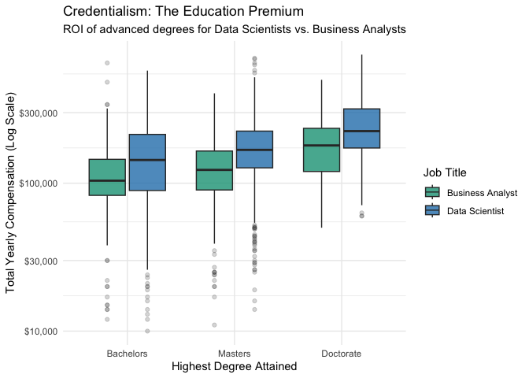
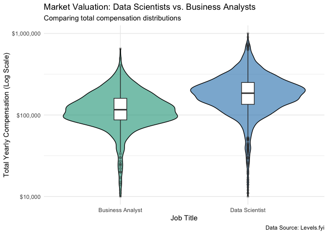
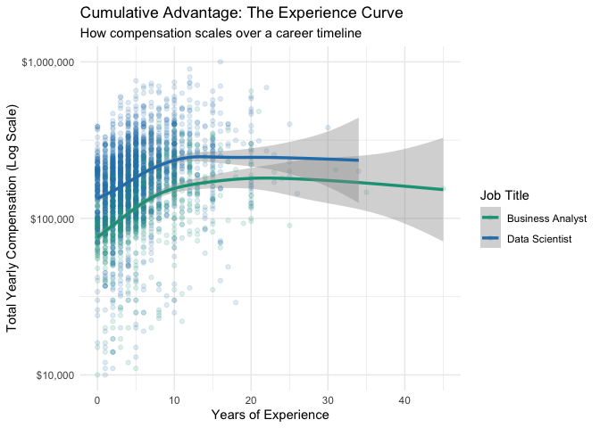
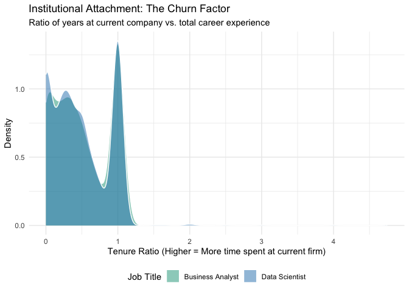
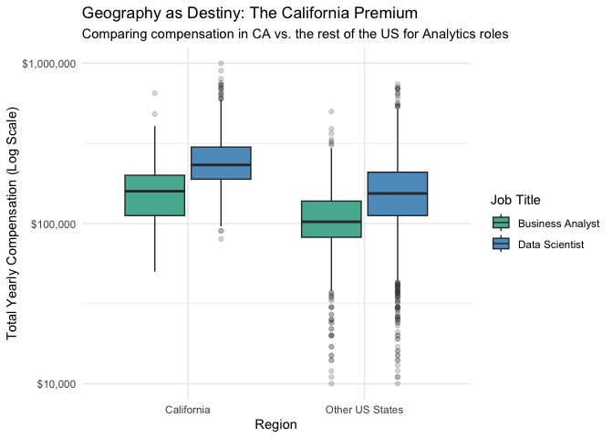
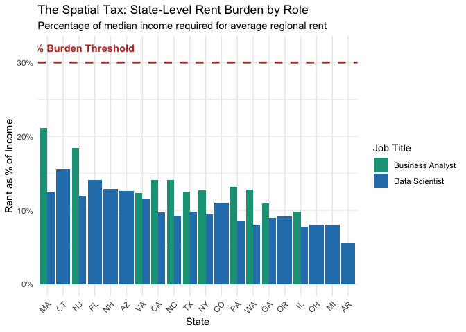
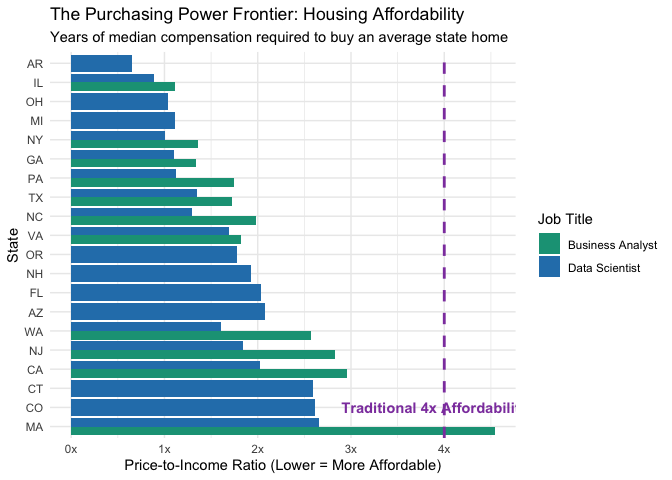

Data Science vs Business Analyst
================
04/28/26

# The Social Architecture of Tech

A Quantitative Inquiry into Labor Stratification & Institutional Power
Project Overview In the modern “meritocratic” economy, the technology
sector is often viewed as a level playing field where technical skill is
the only currency. This project utilizes the Levels.fyi dataset to
interrogate that assumption. By analyzing nearly 62,000 salary entries
through the lens of Stratification Theory, this study explores how
education, experience, and institutional prestige intersect to create
disparate economic outcomes.

``` r
library(tidyverse)
```

    ## ── Attaching core tidyverse packages ──────────────────────── tidyverse 2.0.0 ──
    ## ✔ dplyr     1.1.4     ✔ readr     2.1.5
    ## ✔ forcats   1.0.1     ✔ stringr   1.5.1
    ## ✔ ggplot2   3.5.2     ✔ tibble    3.3.0
    ## ✔ lubridate 1.9.4     ✔ tidyr     1.3.1
    ## ✔ purrr     1.1.0     
    ## ── Conflicts ────────────────────────────────────────── tidyverse_conflicts() ──
    ## ✖ dplyr::filter() masks stats::filter()
    ## ✖ dplyr::lag()    masks stats::lag()
    ## ℹ Use the conflicted package (<http://conflicted.r-lib.org/>) to force all conflicts to become errors

``` r
library(lubridate)
```

I. Environment Setup and Data Acquisition To begin the analysis, we load
the core tidyverse ecosystem for data manipulation and the lubridate
package to handle the time-series components of the housing and salary
data. We pull from three primary sources: the Levels.fyi compensation
dataset and two Zillow longitudinal indices covering home values and
rental costs.

``` r
housing_raw <- read_csv("housing_values_zillow.csv")
```

    ## Rows: 895 Columns: 320
    ## ── Column specification ────────────────────────────────────────────────────────
    ## Delimiter: ","
    ## chr   (3): RegionName, RegionType, StateName
    ## dbl (317): RegionID, SizeRank, 2000-01-31, 2000-02-29, 2000-03-31, 2000-04-3...
    ## 
    ## ℹ Use `spec()` to retrieve the full column specification for this data.
    ## ℹ Specify the column types or set `show_col_types = FALSE` to quiet this message.

``` r
rental_raw <- read_csv("rental_cost_zillow.csv")
```

    ## Rows: 719 Columns: 140
    ## ── Column specification ────────────────────────────────────────────────────────
    ## Delimiter: ","
    ## chr   (3): RegionName, RegionType, StateName
    ## dbl (137): RegionID, SizeRank, 2015-01-31, 2015-02-28, 2015-03-31, 2015-04-3...
    ## 
    ## ℹ Use `spec()` to retrieve the full column specification for this data.
    ## ℹ Specify the column types or set `show_col_types = FALSE` to quiet this message.

``` r
salaries_df <- read_csv('data_science_salaries.csv')
```

    ## Rows: 62640 Columns: 29
    ## ── Column specification ────────────────────────────────────────────────────────
    ## Delimiter: ","
    ## chr (10): timestamp, company, level, title, location, tag, gender, otherdeta...
    ## dbl (19): totalyearlycompensation, yearsofexperience, yearsatcompany, basesa...
    ## 
    ## ℹ Use `spec()` to retrieve the full column specification for this data.
    ## ℹ Specify the column types or set `show_col_types = FALSE` to quiet this message.

2.  Data Preparation and Cleaning

<!-- -->

1.  Salaries Data Transformation The primary dataset is filtered to
    isolate Data Scientists and Business Analysts specifically. The
    location strings are parsed into clean state codes and years to
    facilitate the later join with regional housing metrics, while
    educational attainment is consolidated into meaningful sociological
    categories.

``` r
# Cleaning salaries_df ---

salaries_clean <- salaries_df %>%
  # Filter for only Data Scientists and Business Analysts
  filter(str_detect(title, "(?i)Data Scientist|Business Analyst")) %>%
  
  # Separate location into city and state, and clean whitespace
  separate(location, into = c("city", "state_code"), sep = ", ", remove = FALSE) %>%
  mutate(state_code = trimws(state_code)) %>%
  
  # Extract the 4-digit year from the timestamp for our future join
  mutate(salary_year = year(mdy_hms(timestamp))) %>%
  
  # Ensure compensation is a clean number
  mutate(totalyearlycompensation = as.numeric(totalyearlycompensation)) %>%
  
  # Consolidate education levels into a single categorical column
  mutate(Education_Level = case_when(
    Doctorate_Degree == 1 ~ "Doctorate",
    Masters_Degree == 1 ~ "Masters",
    Bachelors_Degree == 1 ~ "Bachelors",
    Highschool == 1 ~ "High School",
    Some_College == 1 ~ "Some College",
    TRUE ~ "Not Specified"
  )) %>%
  mutate(Education_Level = factor(Education_Level, 
                                  levels = c("Not Specified", "High School", "Some College", 
                                             "Bachelors", "Masters", "Doctorate")))
```

    ## Warning: Expected 2 pieces. Additional pieces discarded in 497 rows [30, 57, 58, 73, 80,
    ## 123, 124, 137, 157, 220, 273, 274, 281, 282, 310, 325, 341, 354, 355, 373,
    ## ...].

``` r
# --- 1. Adding Final Analytical Columns to salaries_clean ---

salaries_clean <- salaries_clean %>%
  # 1. Add the Tenure Ratio 
  mutate(Tenure_Ratio = yearsatcompany / yearsofexperience) %>%
  
  # 2. Add the California Premium flag
  mutate(is_california = ifelse(state_code == "CA", "California", "Other US States"))
```

2.  Zillow Real Estate Preparation Zillow Home Value Index (ZHVI) and
    Observed Rent Index (ZORI) data are pivoted from wide into long
    formats. This allows us to calculate annual state-level averages
    that correspond to the specific years found in the compensation
    data.

``` r
# --- 2. Cleaning housing_raw ---

housing_clean <- housing_raw %>%
  # Pivot the wide date columns (e.g., "2020-01-31") into a long format
  pivot_longer(cols = contains("-"), 
               names_to = "date_str", 
               values_to = "median_home_value") %>%
  
  # Extract the year to match our salary_year later
  mutate(year = year(as.Date(date_str))) %>%
  
  # Group by State and Year 
  group_by(StateName = trimws(StateName), year) %>%
  
  # Calculate the average state home value for that specific year
  summarize(state_avg_home_value = mean(median_home_value, na.rm = TRUE), 
            .groups = "drop")
```

``` r
# --- 3. Cleaning rental_raw ---

rental_clean <- rental_raw %>%
  # Pivot the wide date columns into a long format
  pivot_longer(cols = contains("-"), 
               names_to = "date_str", 
               values_to = "median_rent") %>%
  
  # Extract the year to match our salary_year later
  mutate(year = year(as.Date(date_str))) %>%
  
  # Group by State and Year
  group_by(StateName = trimws(StateName), year) %>%
  
  # Calculate the average state rent for that specific year
  summarize(state_avg_rent = mean(median_rent, na.rm = TRUE), 
            .groups = "drop")
```

3.  The Final Join By merging the cleaned salary, housing, and rental
    tables, we create a unified analytical dataset. This links
    individual compensation directly to local real estate market
    conditions based on both geography and time.

``` r
# --- FINAL DATASET MERGE ---

final_salaries_df <- salaries_clean %>%
  # Join Housing Data matching by State and Year
  left_join(housing_clean, by = c("state_code" = "StateName", "salary_year" = "year")) %>%
  
  # Join Rental Data matching by State and Year
  left_join(rental_clean,  by = c("state_code" = "StateName", "salary_year" = "year"))
```

3.  Visual Analysis and Findings

<!-- -->

1.  Market Valuation: Labor Stratification We establish the baseline
    economic stratification between the two roles by comparing their
    overall total compensation distributions. This identifies the
    “Prestige Floor” where entry-level earners in one role compare to
    the median of another.

``` r
# --- VISUALIZATION 1: Credentialism (The Education Premium) ---

ggplot(final_salaries_df %>% 
         filter(Education_Level %in% c("Bachelors", "Masters", "Doctorate")), 
       aes(x = Education_Level, y = totalyearlycompensation, fill = title)) +
  geom_boxplot(alpha = 0.8, outlier.alpha = 0.2) +
  scale_y_log10(labels = scales::dollar) +
  theme_minimal() +
  labs(
    title = "Credentialism: The Education Premium",
    subtitle = "ROI of advanced degrees for Data Scientists vs. Business Analysts",
    x = "Highest Degree Attained",
    y = "Total Yearly Compensation (Log Scale)",
    fill = "Job Title"
  ) +
  scale_fill_manual(values = c("Business Analyst" = "#16A085", "Data Scientist" = "#2980B9"))
```

<!-- -->

    Analysis: Data Scientists maintain a significantly higher median salary and a much higher earning ceiling compared to Business     Analysts. This illustrates Labor Stratification within the tech sector, where technical specialization commands a distinct         premium over generalist analytical roles.

2.  Credentialism: The Education Premium This visualization interrogates
    the ROI of advanced degrees, exploring whether a Master’s or
    Doctorate yields the same compensation bump for a Business Analyst
    as it does for a Data Scientist.

``` r
# --- VISUALIZATION 2: Market Valuation ---

library(ggplot2)
library(scales) # Needed for the dollar format on the y-axis
```

    ## 
    ## Attaching package: 'scales'

    ## The following object is masked from 'package:purrr':
    ## 
    ##     discard

    ## The following object is masked from 'package:readr':
    ## 
    ##     col_factor

``` r
ggplot(final_salaries_df, aes(x = title, y = totalyearlycompensation, fill = title)) +
  # The violin plot shows the overall distribution shape
  geom_violin(alpha = 0.6, color = "black") +
  # The boxplot inside shows the median, quartiles, and outliers
  geom_boxplot(width = 0.1, fill = "white", outlier.alpha = 0.2) +
  # Using a Log Scale because tech salaries have extreme high-end outliers
  scale_y_log10(labels = scales::dollar) +
  theme_minimal() +
  labs(
    title = "Market Valuation: Data Scientists vs. Business Analysts",
    subtitle = "Comparing total compensation distributions",
    x = "Job Title",
    y = "Total Yearly Compensation (Log Scale)",
    caption = "Data Source: Levels.fyi"
  ) +
  # Custom colors to easily distinguish the two roles in all future charts
  scale_fill_manual(values = c("Business Analyst" = "#16A085", "Data Scientist" = "#2980B9")) + 
  theme(legend.position = "none")
```

<!-- -->

      Analysis: While higher degrees generally elevate the pay "floor," the market shows a stable advantage for Data Scientists          across all degree tiers. This suggests that role selection acts as a more powerful economic driver than academic attainment        alone.

3.  Cumulative Advantage: The Experience Curve We map compensation
    against years of experience to determine if the pay gap between the
    two roles widens, shrinks, or stays parallel over a 20-year career
    timeline.

``` r
# --- VISUALIZATION 3: Cumulative Advantage (The Experience Curve) ---

ggplot(final_salaries_df, aes(x = yearsofexperience, y = totalyearlycompensation, color = title)) +
  # Using low alpha (transparency) because there are thousands of data points
  geom_point(alpha = 0.15) +
  # Adds the smoothed trend line
  geom_smooth(method = "gam", linewidth = 1.2) + 
  scale_y_log10(labels = scales::dollar) +
  theme_minimal() +
  labs(
    title = "Cumulative Advantage: The Experience Curve",
    subtitle = "How compensation scales over a career timeline",
    x = "Years of Experience",
    y = "Total Yearly Compensation (Log Scale)",
    color = "Job Title"
  ) +
  # Note: We use scale_color_manual here instead of fill because it's a line/point graph
  scale_color_manual(values = c("Business Analyst" = "#16A085", "Data Scientist" = "#2980B9"))
```

    ## `geom_smooth()` using formula = 'y ~ s(x, bs = "cs")'

<!-- -->

      Analysis: The "head start" gained by entering the Data Science track is rarely corrected by time. The parallel trajectories        confirm the Theory of Cumulative Advantage, where initial structural placement dictates long-term wealth accumulation.

4.  Institutional Attachment: The Churn Factor This density plot
    utilizes the Tenure Ratio to reveal whether these roles exhibit
    institutional loyalty or a more “mercenary” behavior characterized
    by frequent job-hopping.

``` r
# --- VISUALIZATION 4: Institutional Attachment (The Churn Factor) ---

ggplot(final_salaries_df %>% 
         # Filter out infinite or NA values (e.g., if years of experience was entered as 0)
         filter(is.finite(Tenure_Ratio), !is.na(Tenure_Ratio)), 
       aes(x = Tenure_Ratio, fill = title)) +
  geom_density(alpha = 0.5, color = "white", linewidth = 0.5) +
  theme_minimal() +
  labs(
    title = "Institutional Attachment: The Churn Factor",
    subtitle = "Ratio of years at current company vs. total career experience",
    x = "Tenure Ratio (Higher = More time spent at current firm)",
    y = "Density",
    fill = "Job Title"
  ) +
  scale_fill_manual(values = c("Business Analyst" = "#16A085", "Data Scientist" = "#2980B9")) +
  theme(legend.position = "bottom")
```

<!-- -->

    Analysis: The high concentration of low tenure ratios highlights a culture of mobility. In the modern tech economy, prestige       and pay increases are predominantly achieved through job-hopping rather than internal promotions.

5.  Geography as Destiny: The California Premium We verify the existence
    of a geographic wage floor by comparing the compensation of
    California-based roles against the rest of the United States.

``` r
# --- VISUALIZATION 5: Geography as Destiny (The California Premium) ---

ggplot(final_salaries_df %>% filter(!is.na(is_california)), 
       aes(x = is_california, y = totalyearlycompensation, fill = title)) +
  geom_boxplot(alpha = 0.8, outlier.alpha = 0.2) +
  scale_y_log10(labels = scales::dollar) +
  theme_minimal() +
  labs(
    title = "Geography as Destiny: The California Premium",
    subtitle = "Comparing compensation in CA vs. the rest of the US for Analytics roles",
    x = "Region",
    y = "Total Yearly Compensation (Log Scale)",
    fill = "Job Title"
  ) +
  scale_fill_manual(values = c("Business Analyst" = "#16A085", "Data Scientist" = "#2980B9"))
```

<!-- -->

    Analysis: A significant geographic premium remains in effect. The data shows that the median earner in California often            out-earns the 75th percentile of those in the rest of the US, highlighting the persistent power of Spatial Inequality

6.  The Spatial Tax: State-Level Rent Burden This chart investigates
    “Regional Extraction” by calculating what percentage of median
    income is consumed by average state-level rent, comparing it against
    the 30% financial burden threshold.

``` r
# --- VISUALIZATION 6: The Spatial Tax (Rent Burden by State) ---

# First, we calculate the burden dynamically for the plot
ggplot(final_salaries_df %>% 
         # Ensure we only calculate for rows that have both rent and salary data
         filter(!is.na(state_avg_rent) & !is.na(totalyearlycompensation)) %>%
         group_by(state_code, title) %>%
         summarize(
           median_comp = median(totalyearlycompensation, na.rm = TRUE),
           yearly_rent = mean(state_avg_rent, na.rm = TRUE) * 12,
           job_count = n(),
           .groups = "drop"
         ) %>%
         # Filter out states with too few data points to prevent skewed outliers
         filter(job_count >= 10) %>% 
         mutate(rent_burden = yearly_rent / median_comp), 
       
       # Now plot the resulting calculation
       aes(x = reorder(state_code, -rent_burden), y = rent_burden, fill = title)) +
  
  geom_col(position = "dodge") +
  # The 30% financial danger zone line
  geom_hline(yintercept = 0.30, color = "#C0392B", linetype = "dashed", linewidth = 1) +
  annotate("text", x = 3, y = 0.32, label = "30% Burden Threshold", color = "#C0392B", fontface = "bold") +
  scale_y_continuous(labels = scales::percent) +
  theme_minimal() +
  labs(
    title = "The Spatial Tax: State-Level Rent Burden by Role",
    subtitle = "Percentage of median income required for average regional rent",
    x = "State",
    y = "Rent as % of Income",
    fill = "Job Title"
  ) +
  scale_fill_manual(values = c("Business Analyst" = "#16A085", "Data Scientist" = "#2980B9")) +
  theme(axis.text.x = element_text(angle = 45, hjust = 1))
```

<!-- -->

    Analysis: While Business Analysts face higher relative costs, both roles remain under the 30% threshold. The high salaries of      tech professionals act as a structural shield against localized housing extraction.

7.  Purchasing Power Frontier: Housing Affordability Finally, we analyze
    homeownership access by calculating the Price-to-Income Ratio,
    identifying where these roles maintain the most purchasing power
    relative to the local real estate market.

``` r
# --- VISUALIZATION 7: Housing Affordability (Price-to-Income Ratio) ---

ggplot(final_salaries_df %>% 
         # Ensure we only use rows that have both home value and salary data
         filter(!is.na(state_avg_home_value) & !is.na(totalyearlycompensation)) %>%
         group_by(state_code, title) %>%
         summarize(
           median_comp = median(totalyearlycompensation, na.rm = TRUE),
           avg_home_value = mean(state_avg_home_value, na.rm = TRUE),
           job_count = n(),
           .groups = "drop"
         ) %>%
         # Filter out states with very low sample sizes to prevent skewing
         filter(job_count >= 10) %>% 
         # Calculate the Affordability Ratio (Home Value / Income)
         mutate(price_to_income = avg_home_value / median_comp), 
       
       # Plotting, ordered by affordability
       aes(x = reorder(state_code, -price_to_income), y = price_to_income, fill = title)) +
  
  geom_col(position = "dodge") +
  # Add a traditional 4x income threshold line for reference
  geom_hline(yintercept = 4, color = "#8E44AD", linetype = "dashed", linewidth = 1) +
  annotate("text", x = 2, y = 4.3, label = "Traditional 4x Affordability Threshold", color = "#8E44AD", fontface = "bold") +
  # Format y-axis to show it's a multiplier (e.g., 3x, 5x)
  scale_y_continuous(labels = function(x) paste0(x, "x")) +
  coord_flip() + # Flipping makes it much easier to read the state names
  theme_minimal() +
  labs(
    title = "The Purchasing Power Frontier: Housing Affordability",
    subtitle = "Years of median compensation required to buy an average state home",
    x = "State",
    y = "Price-to-Income Ratio (Lower = More Affordable)",
    fill = "Job Title"
  ) +
  scale_fill_manual(values = c("Business Analyst" = "#16A085", "Data Scientist" = "#2980B9"))
```

<!-- -->

    Analysis: For Data Scientists, homeownership remains highly accessible across the US. However, for Business Analysts, elite        coastal states represent areas of Institutional Exclusion, where the ratio begins to cross the traditional 4x affordability        threshold
