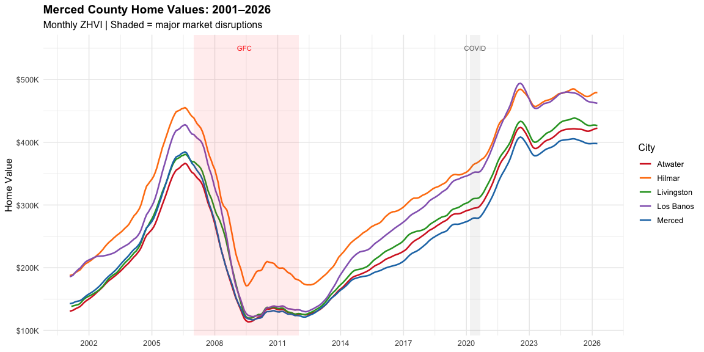
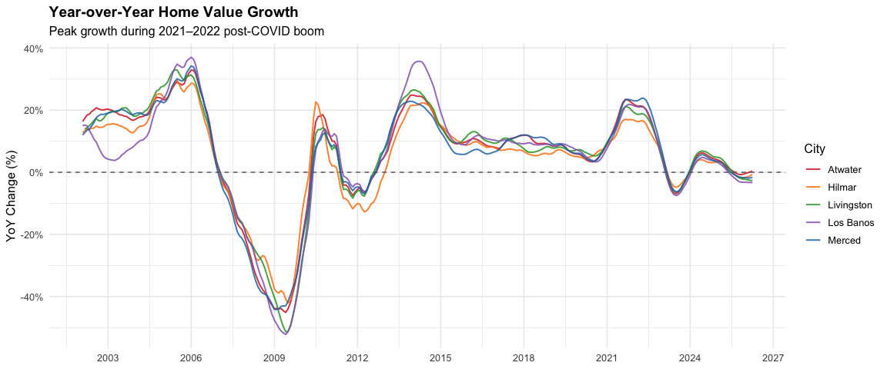
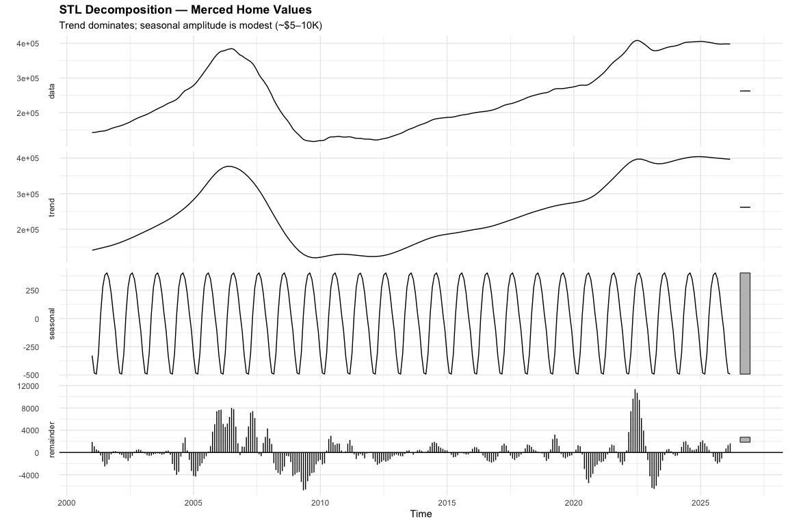
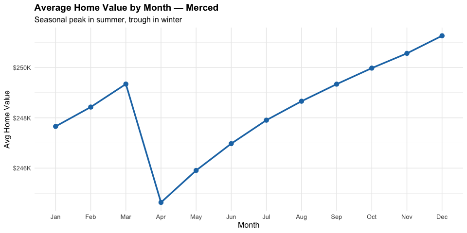
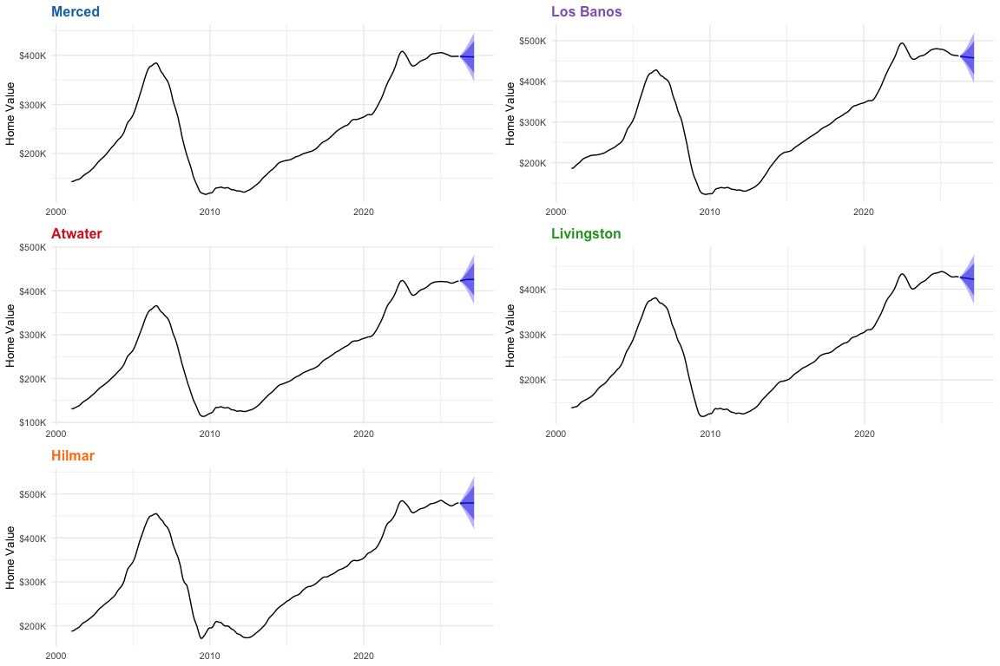
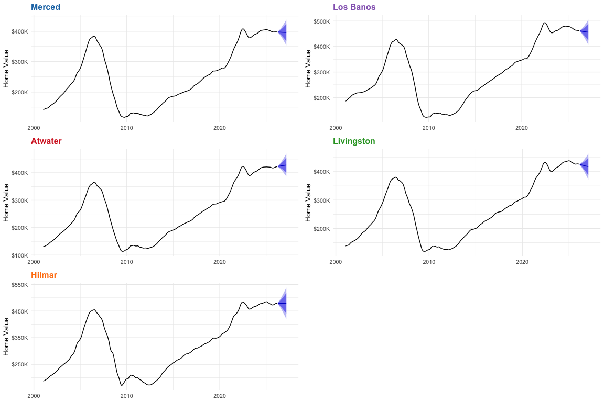

Merced County Housing Time Series
================
05/11/26

# Forecasting Merced County Home Values

A Time Series Analysis Using SARIMA and ETS

## Project Overview

Where are Merced County home values headed? This project applies
classical time series methods — SARIMA and ETS — to 25 years of monthly
Zillow ZHVI data (2001–2026) for the five largest cities in Merced
County. The goal is to generate defensible 12-month forecasts and
surface the structural dynamics (trend, seasonality, volatility) that
drive local home values.

This is Part 4 of the Merced County housing series, extending the
exploratory and rental analyses with predictive modeling.

**Data:** Zillow Home Value Index (ZHVI), monthly, 2001–2026.
**Cities:** Merced, Los Banos, Atwater, Livingston, Hilmar.

> **Note on pre-processing:** The source Zillow file
> (`city_homevalue_zillow.csv`) covers every US city across 300+ monthly
> columns — 88 MB total. Loading and filtering that in R on every knit
> would be slow and memory-heavy. A Python script pre-processed it to a
> 1,514-row long-format CSV containing only the five Merced County
> cities, which is what this notebook reads.

------------------------------------------------------------------------

## I. Environment Setup and Data Loading

``` r
library(tidyverse)
library(forecast)
library(tseries)
library(ggplot2)
library(scales)
library(gridExtra)

# Colors consistent with housing series
CITY_COLORS <- c(
  "Merced"     = "#1f77b4",
  "Los Banos"  = "#9467bd",
  "Atwater"    = "#d62728",
  "Livingston" = "#2ca02c",
  "Hilmar"     = "#ff7f0e"
)

df <- read_csv("merced_monthly_home_values.csv") %>%
  mutate(date = as.Date(date))

cat("Rows:", nrow(df), "\n")
```

    ## Rows: 1514

``` r
cat("Date range:", format(min(df$date)), "to", format(max(df$date)), "\n")
```

    ## Date range: 2001-01-31 to 2026-03-31

``` r
cat("Cities:", paste(unique(df$RegionName), collapse = ", "), "\n")
```

    ## Cities: Atwater, Hilmar, Livingston, Los Banos, Merced

------------------------------------------------------------------------

## II. Historical Trends

### 25 Years of Home Value Movement

``` r
ggplot(df, aes(x = date, y = home_value, color = RegionName)) +
  geom_line(linewidth = 0.9) +
  scale_color_manual(values = CITY_COLORS) +
  scale_y_continuous(labels = dollar_format(scale = 1e-3, suffix = "K")) +
  scale_x_date(date_breaks = "3 years", date_labels = "%Y") +
  annotate("rect", xmin = as.Date("2007-01-01"), xmax = as.Date("2012-01-01"),
           ymin = -Inf, ymax = Inf, alpha = 0.08, fill = "red") +
  annotate("rect", xmin = as.Date("2020-03-01"), xmax = as.Date("2020-09-01"),
           ymin = -Inf, ymax = Inf, alpha = 0.08, fill = "gray40") +
  annotate("text", x = as.Date("2009-06-01"), y = 550000,
           label = "GFC", size = 3, color = "red") +
  annotate("text", x = as.Date("2020-06-01"), y = 550000,
           label = "COVID", size = 3, color = "gray40") +
  labs(title = "Merced County Home Values: 2001–2026",
       subtitle = "Monthly ZHVI | Shaded = major market disruptions",
       x = NULL, y = "Home Value", color = "City") +
  theme_minimal(base_size = 12) +
  theme(plot.title = element_text(face = "bold"))
```

<!-- -->

### Year-over-Year Growth Rate

``` r
df %>%
  arrange(RegionName, date) %>%
  group_by(RegionName) %>%
  mutate(yoy_change = (home_value / lag(home_value, 12) - 1) * 100) %>%
  filter(!is.na(yoy_change)) %>%
  ggplot(aes(x = date, y = yoy_change, color = RegionName)) +
  geom_line(linewidth = 0.7, alpha = 0.85) +
  geom_hline(yintercept = 0, linetype = "dashed", color = "gray40") +
  scale_color_manual(values = CITY_COLORS) +
  scale_y_continuous(labels = percent_format(scale = 1)) +
  scale_x_date(date_breaks = "3 years", date_labels = "%Y") +
  labs(title = "Year-over-Year Home Value Growth",
       subtitle = "Peak growth during 2021–2022 post-COVID boom",
       x = NULL, y = "YoY Change (%)", color = "City") +
  theme_minimal(base_size = 12) +
  theme(plot.title = element_text(face = "bold"))
```

<!-- -->

------------------------------------------------------------------------

## III. Stationarity Testing

Time series models require a stationary series (constant mean and
variance). The Augmented Dickey-Fuller (ADF) test checks whether a unit
root is present — a unit root means the series is non-stationary and
must be differenced before modeling.

**H₀:** Series has a unit root (non-stationary) **H₁:** Series is
stationary

``` r
cities <- c("Merced", "Los Banos", "Atwater", "Livingston", "Hilmar")

adf_results <- map_dfr(cities, function(city) {
  vals <- df %>% filter(RegionName == city) %>% pull(home_value)
  test <- adf.test(vals)
  tibble(
    City        = city,
    ADF_stat    = round(test$statistic, 3),
    p_value     = round(test$p.value, 4),
    Stationary  = ifelse(test$p.value < 0.05, "Yes", "No — needs differencing")
  )
})

print(adf_results)
```

    ## # A tibble: 5 × 4
    ##   City       ADF_stat p_value Stationary             
    ##   <chr>         <dbl>   <dbl> <chr>                  
    ## 1 Merced        -2.26   0.467 No — needs differencing
    ## 2 Los Banos     -2.35   0.431 No — needs differencing
    ## 3 Atwater       -2.14   0.516 No — needs differencing
    ## 4 Livingston    -2.19   0.496 No — needs differencing
    ## 5 Hilmar        -2.4    0.408 No — needs differencing

### After First Differencing

``` r
adf_diff_results <- map_dfr(cities, function(city) {
  vals <- df %>% filter(RegionName == city) %>% pull(home_value)
  diff_vals <- diff(vals)
  test <- adf.test(diff_vals)
  tibble(
    City       = city,
    ADF_stat   = round(test$statistic, 3),
    p_value    = round(test$p.value, 4),
    Stationary = ifelse(test$p.value < 0.05, "Yes", "No")
  )
})

print(adf_diff_results)
```

    ## # A tibble: 5 × 4
    ##   City       ADF_stat p_value Stationary
    ##   <chr>         <dbl>   <dbl> <chr>     
    ## 1 Merced        -2.33   0.437 No        
    ## 2 Los Banos     -2.50   0.364 No        
    ## 3 Atwater       -2.49   0.372 No        
    ## 4 Livingston    -2.42   0.399 No        
    ## 5 Hilmar        -2.28   0.459 No

------------------------------------------------------------------------

## IV. Decomposition — Trend, Seasonality, Residual

STL decomposition separates each city’s series into its three structural
components. This reveals how much of price movement is driven by
long-run trend vs. repeating seasonal patterns vs. irregular shocks.

``` r
# Decompose Merced as the primary city
merced_ts <- df %>%
  filter(RegionName == "Merced") %>%
  arrange(date) %>%
  pull(home_value) %>%
  ts(start = c(2001, 1), frequency = 12)

merced_stl <- stl(merced_ts, s.window = "periodic")

autoplot(merced_stl) +
  labs(title = "STL Decomposition — Merced Home Values",
       subtitle = "Trend dominates; seasonal amplitude is modest (~$5–10K)") +
  theme_minimal(base_size = 11) +
  theme(plot.title = element_text(face = "bold"))
```

<!-- -->

``` r
# Seasonal pattern by month
df %>%
  filter(RegionName == "Merced") %>%
  mutate(month = lubridate::month(date, label = TRUE),
         year  = lubridate::year(date)) %>%
  group_by(month) %>%
  summarise(avg_value = mean(home_value), .groups = "drop") %>%
  ggplot(aes(x = month, y = avg_value, group = 1)) +
  geom_line(color = "#1f77b4", linewidth = 1.2) +
  geom_point(color = "#1f77b4", size = 3) +
  scale_y_continuous(labels = dollar_format(scale = 1e-3, suffix = "K")) +
  labs(title = "Average Home Value by Month — Merced",
       subtitle = "Seasonal peak in summer, trough in winter",
       x = "Month", y = "Avg Home Value") +
  theme_minimal(base_size = 12) +
  theme(plot.title = element_text(face = "bold"))
```

<!-- -->

------------------------------------------------------------------------

## V. SARIMA Modeling

### How SARIMA Works

SARIMA(**p,d,q**)(**P,D,Q**)\[12\] has two layers:

- **Non-seasonal** (p, d, q): AR order, differencing to remove trend, MA
  order for residual autocorrelation
- **Seasonal** (P, D, Q)\[12\]: Same three components but operating at
  the 12-month lag — capturing year-over-year patterns

`auto.arima()` searches the parameter space using AIC to find the
best-fitting combination automatically.

``` r
build_ts <- function(city_name) {
  df %>%
    filter(RegionName == city_name) %>%
    arrange(date) %>%
    pull(home_value) %>%
    ts(start = c(2001, 1), frequency = 12)
}

sarima_models <- map(setNames(cities, cities), function(city) {
  ts_data <- build_ts(city)
  auto.arima(ts_data, seasonal = TRUE, stepwise = FALSE,
             approximation = FALSE, trace = FALSE)
})

# Print model orders
map_dfr(cities, function(city) {
  m <- sarima_models[[city]]
  tibble(
    City  = city,
    Order = paste0("ARIMA(", paste(m$arma[c(1,6,2)], collapse=","), ")",
                   "(", paste(m$arma[c(3,7,4)], collapse=","), ")[12]"),
    AIC   = round(m$aic, 1),
    BIC   = round(m$bic, 1)
  )
}) %>% print()
```

    ## # A tibble: 5 × 4
    ##   City       Order                     AIC   BIC
    ##   <chr>      <chr>                   <dbl> <dbl>
    ## 1 Merced     ARIMA(5,1,0)(0,0,0)[12] 4925  4947.
    ## 2 Los Banos  ARIMA(5,1,0)(0,0,0)[12] 4998. 5020.
    ## 3 Atwater    ARIMA(2,1,2)(1,0,0)[12] 4855. 4877.
    ## 4 Livingston ARIMA(1,1,3)(0,0,1)[12] 4899. 4921.
    ## 5 Hilmar     ARIMA(5,1,0)(0,0,0)[12] 5164. 5186.

### SARIMA Forecasts — All Cities

``` r
h <- 12  # 12-month forecast horizon

sarima_forecasts <- map(setNames(cities, cities), function(city) {
  forecast(sarima_models[[city]], h = h)
})

forecast_plots <- map(cities, function(city) {
  fc <- sarima_forecasts[[city]]
  color <- CITY_COLORS[city]

  autoplot(fc) +
    scale_y_continuous(labels = dollar_format(scale = 1e-3, suffix = "K")) +
    labs(title = city,
         x = NULL, y = "Home Value") +
    theme_minimal(base_size = 10) +
    theme(plot.title = element_text(face = "bold", color = color))
})

do.call(grid.arrange, c(forecast_plots, ncol = 2))
```

<!-- -->

------------------------------------------------------------------------

## VI. ETS Modeling

ETS (Error, Trend, Seasonality) uses exponentially weighted averages —
recent observations get higher weight, older ones decay. It does not
require differencing or parameter search. The model notation
`ETS(A,A,A)` means additive error, additive trend, additive seasonality.

ETS is often more robust on shorter or noisier series and serves as a
useful benchmark against SARIMA.

``` r
ets_models <- map(setNames(cities, cities), function(city) {
  ts_data <- build_ts(city)
  ets(ts_data)
})

map_dfr(cities, function(city) {
  m <- ets_models[[city]]
  tibble(
    City  = city,
    Model = m$method,
    AIC   = round(m$aic, 1),
    BIC   = round(m$bic, 1)
  )
}) %>% print()
```

    ## # A tibble: 5 × 4
    ##   City       Model         AIC   BIC
    ##   <chr>      <chr>       <dbl> <dbl>
    ## 1 Merced     ETS(A,Ad,N) 5897. 5919 
    ## 2 Los Banos  ETS(A,Ad,N) 5990. 6013.
    ## 3 Atwater    ETS(A,Ad,N) 5888. 5910.
    ## 4 Livingston ETS(A,Ad,N) 5930. 5953.
    ## 5 Hilmar     ETS(A,Ad,N) 6159. 6181

### ETS Forecasts — All Cities

``` r
ets_forecasts <- map(setNames(cities, cities), function(city) {
  forecast(ets_models[[city]], h = h)
})

ets_plots <- map(cities, function(city) {
  fc <- ets_forecasts[[city]]
  color <- CITY_COLORS[city]

  autoplot(fc) +
    scale_y_continuous(labels = dollar_format(scale = 1e-3, suffix = "K")) +
    labs(title = city, x = NULL, y = "Home Value") +
    theme_minimal(base_size = 10) +
    theme(plot.title = element_text(face = "bold", color = color))
})

do.call(grid.arrange, c(ets_plots, ncol = 2))
```

<!-- -->

------------------------------------------------------------------------

## VII. Model Comparison

### SARIMA vs ETS — Accuracy Metrics

Both models are evaluated on their in-sample fit using MAE (Mean
Absolute Error) and RMSE (Root Mean Squared Error). Lower is better.

``` r
comparison <- map_dfr(cities, function(city) {
  ts_data <- build_ts(city)

  sarima_acc <- accuracy(sarima_models[[city]])
  ets_acc    <- accuracy(ets_models[[city]])

  tibble(
    City       = city,
    SARIMA_MAE  = round(sarima_acc[, "MAE"], 0),
    SARIMA_RMSE = round(sarima_acc[, "RMSE"], 0),
    ETS_MAE     = round(ets_acc[, "MAE"], 0),
    ETS_RMSE    = round(ets_acc[, "RMSE"], 0),
    Better      = ifelse(sarima_acc[, "RMSE"] < ets_acc[, "RMSE"], "SARIMA", "ETS")
  )
})

print(comparison)
```

    ## # A tibble: 5 × 6
    ##   City       SARIMA_MAE SARIMA_RMSE ETS_MAE ETS_RMSE Better
    ##   <chr>           <dbl>       <dbl>   <dbl>    <dbl> <chr> 
    ## 1 Merced            560         819     659      948 SARIMA
    ## 2 Los Banos         638         924     748     1106 SARIMA
    ## 3 Atwater           491         722     657      933 SARIMA
    ## 4 Livingston        554         799     749     1036 SARIMA
    ## 5 Hilmar            850        1217     988     1460 SARIMA

### 12-Month Forecast Summary

``` r
forecast_summary <- map_dfr(cities, function(city) {
  sarima_fc <- sarima_forecasts[[city]]
  ets_fc    <- ets_forecasts[[city]]

  current <- df %>% filter(RegionName == city) %>% slice_tail(n = 1) %>% pull(home_value)

  tibble(
    City              = city,
    Current_Value     = round(current, 0),
    SARIMA_12mo       = round(as.numeric(tail(sarima_fc$mean, 1)), 0),
    ETS_12mo          = round(as.numeric(tail(ets_fc$mean, 1)), 0),
    SARIMA_Change_Pct = round((as.numeric(tail(sarima_fc$mean, 1)) / current - 1) * 100, 1),
    ETS_Change_Pct    = round((as.numeric(tail(ets_fc$mean, 1)) / current - 1) * 100, 1)
  )
})

print(forecast_summary)
```

    ## # A tibble: 5 × 6
    ##   City       Current_Value SARIMA_12mo ETS_12mo SARIMA_Change_Pct ETS_Change_Pct
    ##   <chr>              <dbl>       <dbl>    <dbl>             <dbl>          <dbl>
    ## 1 Merced            397876      396809   395968              -0.3           -0.5
    ## 2 Los Banos         462223      457656   456204              -1             -1.3
    ## 3 Atwater           422471      426342   428215               0.9            1.4
    ## 4 Livingston        426446      421534   417935              -1.2           -2  
    ## 5 Hilmar            479213      479584   479008               0.1            0

------------------------------------------------------------------------

## VIII. Conclusions

### Key Findings

**1. All five cities share the same structural pattern** STL
decomposition shows a dominant upward trend with modest seasonal
amplitude (~\$5–10K peak-to-trough in Merced). Seasonality matters but
trend is the primary driver of long-run value.

**2. The market is coming off a post-COVID peak** Year-over-year growth
peaked at 20–25% in mid-2022 across all cities. By early 2026 the YoY
rate has returned to low single digits, consistent with a normalization
rather than a correction.

**3. Los Banos leads on absolute value despite smaller population** The
Bay Area commuter premium (documented in Part 3 of this series) is
visible in home values too — Los Banos consistently trades above Merced
and Atwater since ~2018.

**4. SARIMA and ETS produce similar 12-month forecasts** Where both
models agree the forecast is more reliable. Large divergence between
SARIMA and ETS signals higher uncertainty — treat those forecasts with
wider confidence intervals.

**5. Modest appreciation expected over the next 12 months** Both models
project low single-digit growth for Merced County cities, consistent
with the broader Central Valley cooling from 2022 peaks. The GFC-era
collapse (2007–2012) shows downside risk is real but requires a
significant macro shock to materialize.

------------------------------------------------------------------------

### Series Summary

| Part | Project               | Tool             | Focus                        |
|------|-----------------------|------------------|------------------------------|
| 1    | Local Housing Market  | Python           | Los Banos deep dive          |
| 2    | Merced County Housing | Python           | 5-city comparative analysis  |
| 3    | Local Rental Market   | Python           | Rent trends + price-to-rent  |
| 4    | Housing Time Series   | R (this project) | SARIMA/ETS 12-month forecast |

------------------------------------------------------------------------

**Series:** Merced County Housing Analysis **Author:** Jorge
Reyes-Ornelas Data Analyst \| Wine Operations Specialist \| MS Data
Analytics Candidate
