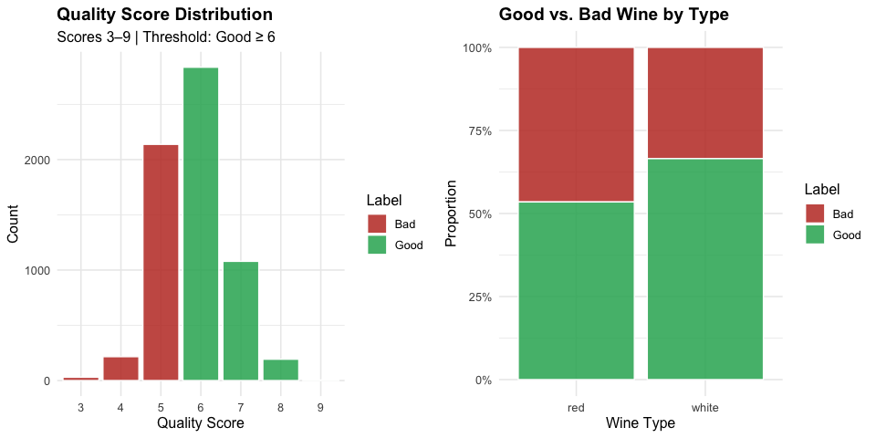
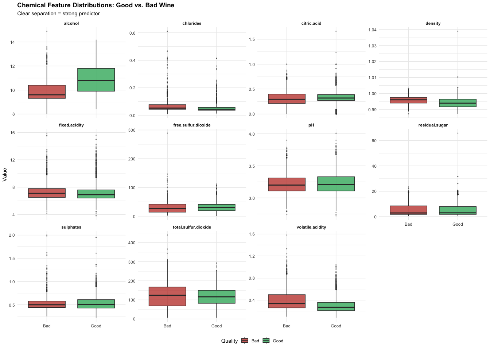
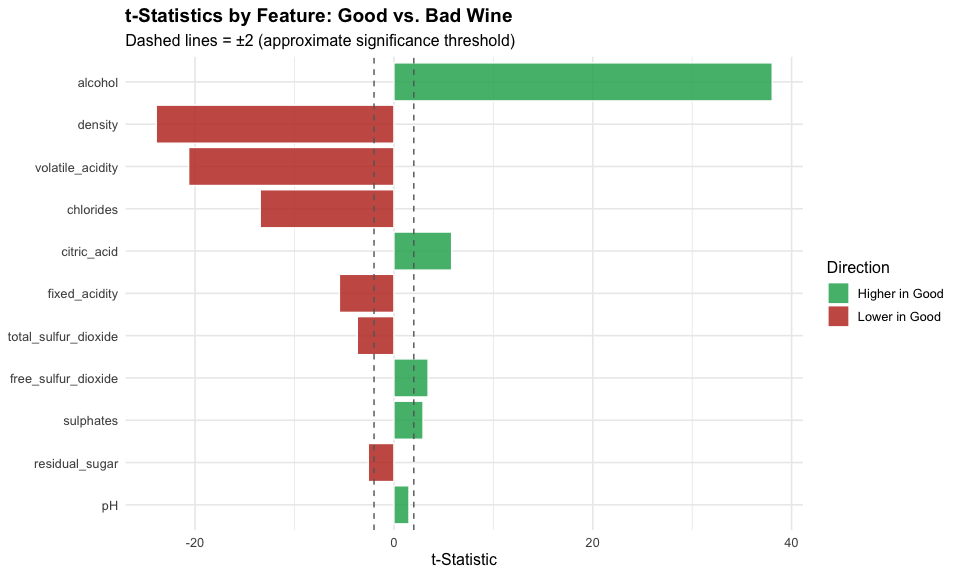
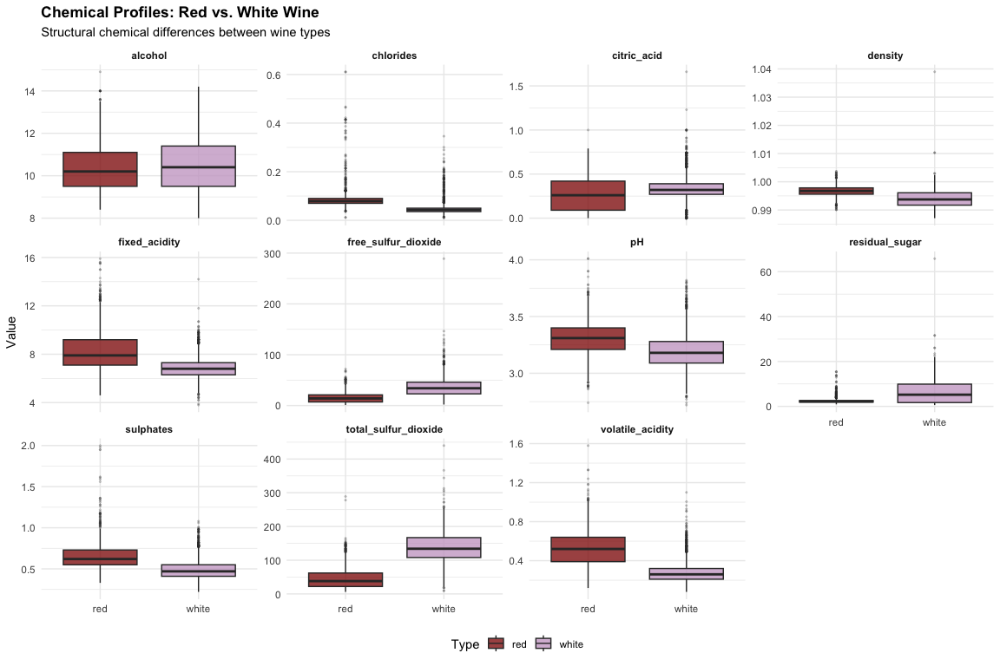
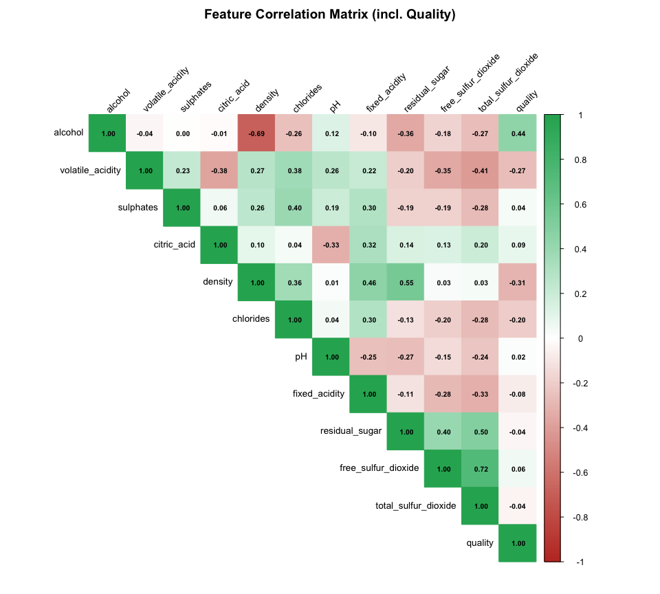
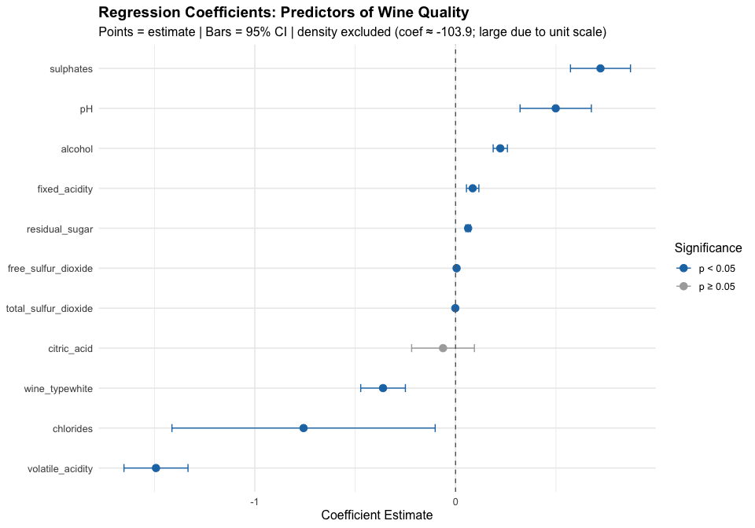

Wine Quality Statistical Analysis
================
05/11/26

# The Chemistry of Quality

A Statistical Inquiry into What Makes Wine Good

## Project Overview

The wine industry spends billions on sensory evaluation — trained
panels, blind tastings, and expert scoring. But can chemistry alone
predict quality? This project applies classical statistical methods to
the UCI Wine Quality dataset to determine which physicochemical
properties are statistically significant predictors of wine quality, and
whether red and white wines obey different chemical rules.

Where the companion Python project (ML Wine Quality) asks *can a model
predict quality?*, this analysis asks *why* — using ANOVA, t-tests,
correlation, and linear regression to surface the structural chemical
differences between good and bad wines.

**Dataset:** 6,497 wines (1,599 red + 4,898 white), 11 chemical
features, quality scores 3–9.

------------------------------------------------------------------------

## I. Environment Setup and Data Loading

``` r
library(tidyverse)
library(ggplot2)
library(corrplot)
library(broom)
library(gridExtra)
library(scales)

# Load data
wine_df <- read_csv("winequality-combined.csv")

# Create binary quality label — matches Python project threshold
wine_df <- wine_df %>%
  mutate(quality_label = ifelse(quality >= 6, "Good", "Bad"),
         quality_label = factor(quality_label, levels = c("Bad", "Good")),
         wine_type = factor(wine_type))

cat("Dataset shape:", nrow(wine_df), "rows,", ncol(wine_df), "columns\n")
```

    ## Dataset shape: 6497 rows, 14 columns

``` r
cat("Red wines:", sum(wine_df$wine_type == "red"), "\n")
```

    ## Red wines: 1599

``` r
cat("White wines:", sum(wine_df$wine_type == "white"), "\n")
```

    ## White wines: 4898

``` r
cat("Good wines (>=6):", sum(wine_df$quality_label == "Good"), "\n")
```

    ## Good wines (>=6): 4113

``` r
cat("Bad wines (<6):", sum(wine_df$quality_label == "Bad"), "\n")
```

    ## Bad wines (<6): 2384

------------------------------------------------------------------------

## II. Exploratory Overview

### Quality Score Distribution

``` r
p1 <- ggplot(wine_df, aes(x = factor(quality), fill = quality_label)) +
  geom_bar(alpha = 0.85, color = "white") +
  scale_fill_manual(values = c("Bad" = "#C0392B", "Good" = "#27AE60")) +
  labs(title = "Quality Score Distribution",
       subtitle = "Scores 3–9 | Threshold: Good ≥ 6",
       x = "Quality Score", y = "Count", fill = "Label") +
  theme_minimal(base_size = 12) +
  theme(plot.title = element_text(face = "bold"))

p2 <- ggplot(wine_df, aes(x = wine_type, fill = quality_label)) +
  geom_bar(position = "fill", alpha = 0.85, color = "white") +
  scale_fill_manual(values = c("Bad" = "#C0392B", "Good" = "#27AE60")) +
  scale_y_continuous(labels = percent) +
  labs(title = "Good vs. Bad Wine by Type",
       x = "Wine Type", y = "Proportion", fill = "Label") +
  theme_minimal(base_size = 12) +
  theme(plot.title = element_text(face = "bold"))

grid.arrange(p1, p2, ncol = 2)
```

<!-- -->

------------------------------------------------------------------------

## III. Feature Distributions — Good vs. Bad Wine

### Do chemical profiles differ between good and bad wines?

Before formal testing, we visualize the distribution of each feature
split by quality label. Features where the distributions separate
clearly are likely significant predictors.

``` r
features <- c("alcohol", "volatile.acidity", "sulphates", "citric.acid",
              "density", "chlorides", "pH", "fixed.acidity",
              "residual.sugar", "free.sulfur.dioxide", "total.sulfur.dioxide")

# Rename columns for R compatibility
wine_plot <- wine_df %>%
  rename(
    volatile.acidity = `volatile acidity`,
    citric.acid = `citric acid`,
    residual.sugar = `residual sugar`,
    free.sulfur.dioxide = `free sulfur dioxide`,
    total.sulfur.dioxide = `total sulfur dioxide`,
    fixed.acidity = `fixed acidity`
  )

wine_long <- wine_plot %>%
  select(all_of(features), quality_label) %>%
  pivot_longer(-quality_label, names_to = "feature", values_to = "value")

ggplot(wine_long, aes(x = quality_label, y = value, fill = quality_label)) +
  geom_boxplot(alpha = 0.75, outlier.size = 0.5, outlier.alpha = 0.3) +
  scale_fill_manual(values = c("Bad" = "#C0392B", "Good" = "#27AE60")) +
  facet_wrap(~feature, scales = "free_y", ncol = 4) +
  labs(title = "Chemical Feature Distributions: Good vs. Bad Wine",
       subtitle = "Clear separation = strong predictor",
       x = NULL, y = "Value", fill = "Quality") +
  theme_minimal(base_size = 11) +
  theme(plot.title = element_text(face = "bold"),
        strip.text = element_text(face = "bold"),
        legend.position = "bottom")
```

<!-- -->

------------------------------------------------------------------------

## IV. Hypothesis Testing — Which Features Are Statistically Significant?

### Welch’s Two-Sample t-Test (Good vs. Bad)

We run Welch’s t-test for each chemical feature comparing good vs. bad
wines. Welch’s variant does not assume equal variance — appropriate here
since group sizes are unequal (4,113 good vs. 2,384 bad).

**H₀:** Mean chemical value is equal between good and bad wines **H₁:**
Mean chemical value differs between good and bad wines

``` r
wine_test <- wine_df %>%
  rename(
    volatile_acidity = `volatile acidity`,
    citric_acid = `citric acid`,
    residual_sugar = `residual sugar`,
    free_sulfur_dioxide = `free sulfur dioxide`,
    total_sulfur_dioxide = `total sulfur dioxide`,
    fixed_acidity = `fixed acidity`
  )

feature_cols <- c("alcohol", "volatile_acidity", "sulphates", "citric_acid",
                  "density", "chlorides", "pH", "fixed_acidity",
                  "residual_sugar", "free_sulfur_dioxide", "total_sulfur_dioxide")

ttest_results <- map_dfr(feature_cols, function(feat) {
  good_vals <- wine_test %>% filter(quality_label == "Good") %>% pull(!!sym(feat))
  bad_vals  <- wine_test %>% filter(quality_label == "Bad")  %>% pull(!!sym(feat))

  test <- t.test(good_vals, bad_vals)

  tibble(
    Feature       = feat,
    Mean_Good     = mean(good_vals),
    Mean_Bad      = mean(bad_vals),
    Difference    = mean(good_vals) - mean(bad_vals),
    t_statistic   = test$statistic,
    p_value       = test$p.value,
    Significant   = ifelse(test$p.value < 0.05, "Yes ***", "No")
  )
}) %>%
  arrange(p_value)

print(ttest_results %>% mutate(across(where(is.numeric), ~round(., 4))),
      n = Inf)
```

    ## # A tibble: 11 × 7
    ##    Feature         Mean_Good Mean_Bad Difference t_statistic p_value Significant
    ##    <chr>               <dbl>    <dbl>      <dbl>       <dbl>   <dbl> <chr>      
    ##  1 alcohol           10.9      9.87       0.977        38.1   0      Yes ***    
    ##  2 density            0.994    0.996     -0.0017      -23.9   0      Yes ***    
    ##  3 volatile_acidi…    0.306    0.397     -0.0912      -20.7   0      Yes ***    
    ##  4 chlorides          0.0512   0.0644    -0.0132      -13.4   0      Yes ***    
    ##  5 citric_acid        0.327    0.304      0.0228        5.81  0      Yes ***    
    ##  6 fixed_acidity      7.15     7.33      -0.181        -5.49  0      Yes ***    
    ##  7 total_sulfur_d…  114.     119.        -5.58         -3.69  0.0002 Yes ***    
    ##  8 free_sulfur_di…   31.1     29.5        1.65          3.44  0.0006 Yes ***    
    ##  9 sulphates          0.535    0.524      0.0111        2.93  0.0034 Yes ***    
    ## 10 residual_sugar     5.33     5.65      -0.321        -2.58  0.0098 Yes ***    
    ## 11 pH                 3.22     3.21       0.0063        1.52  0.129  No

### Visualizing Effect Sizes

``` r
ttest_results %>%
  mutate(Feature = fct_reorder(Feature, abs(t_statistic)),
         Direction = ifelse(Difference > 0, "Higher in Good", "Lower in Good")) %>%
  ggplot(aes(x = Feature, y = t_statistic, fill = Direction)) +
  geom_col(alpha = 0.85, color = "white") +
  geom_hline(yintercept = c(-2, 2), linetype = "dashed", color = "gray40") +
  scale_fill_manual(values = c("Higher in Good" = "#27AE60", "Lower in Good" = "#C0392B")) +
  coord_flip() +
  labs(title = "t-Statistics by Feature: Good vs. Bad Wine",
       subtitle = "Dashed lines = ±2 (approximate significance threshold)",
       x = NULL, y = "t-Statistic", fill = "Direction") +
  theme_minimal(base_size = 12) +
  theme(plot.title = element_text(face = "bold"))
```

<!-- -->

------------------------------------------------------------------------

## V. ANOVA — Does Quality Score Differ by Wine Type?

### Do red and white wines achieve quality through different chemistry?

``` r
# One-way ANOVA: quality score ~ wine type
anova_model <- aov(quality ~ wine_type, data = wine_df)
cat("ANOVA: Quality Score ~ Wine Type\n")
```

    ## ANOVA: Quality Score ~ Wine Type

``` r
print(summary(anova_model))
```

    ##               Df Sum Sq Mean Sq F value Pr(>F)    
    ## wine_type      1     71   70.53   93.81 <2e-16 ***
    ## Residuals   6495   4883    0.75                   
    ## ---
    ## Signif. codes:  0 '***' 0.001 '**' 0.01 '*' 0.05 '.' 0.1 ' ' 1

``` r
# Mean quality by type
wine_df %>%
  group_by(wine_type) %>%
  summarise(
    n = n(),
    mean_quality = round(mean(quality), 3),
    sd_quality   = round(sd(quality), 3),
    pct_good     = round(mean(quality_label == "Good") * 100, 1)
  ) %>%
  print()
```

    ## # A tibble: 2 × 5
    ##   wine_type     n mean_quality sd_quality pct_good
    ##   <fct>     <int>        <dbl>      <dbl>    <dbl>
    ## 1 red        1599         5.64      0.808     53.5
    ## 2 white      4898         5.88      0.886     66.5

### Key Chemical Differences Between Red and White Wines

``` r
wine_test %>%
  select(wine_type, all_of(feature_cols)) %>%
  pivot_longer(-wine_type, names_to = "feature", values_to = "value") %>%
  ggplot(aes(x = wine_type, y = value, fill = wine_type)) +
  geom_boxplot(alpha = 0.75, outlier.size = 0.4, outlier.alpha = 0.2) +
  scale_fill_manual(values = c("red" = "#8B0000", "white" = "#C8A2C8")) +
  facet_wrap(~feature, scales = "free_y", ncol = 4) +
  labs(title = "Chemical Profiles: Red vs. White Wine",
       subtitle = "Structural chemical differences between wine types",
       x = NULL, y = "Value", fill = "Type") +
  theme_minimal(base_size = 11) +
  theme(plot.title = element_text(face = "bold"),
        strip.text = element_text(face = "bold"),
        legend.position = "bottom")
```

<!-- -->

------------------------------------------------------------------------

## VI. Correlation Analysis

### How do features relate to each other and to quality?

``` r
cor_data <- wine_test %>%
  select(all_of(feature_cols), quality) %>%
  cor(use = "complete.obs")

corrplot(cor_data,
         method = "color",
         type = "upper",
         tl.col = "black",
         tl.srt = 45,
         tl.cex = 0.85,
         addCoef.col = "black",
         number.cex = 0.65,
         col = colorRampPalette(c("#C0392B", "white", "#27AE60"))(200),
         title = "Feature Correlation Matrix (incl. Quality)",
         mar = c(0, 0, 2, 0))
```

<!-- -->

------------------------------------------------------------------------

## VII. Linear Regression — Predicting Quality Score

### Which features are the strongest linear predictors of quality?

``` r
lm_model <- lm(quality ~ alcohol + volatile_acidity + sulphates +
                 citric_acid + density + chlorides + pH +
                 fixed_acidity + residual_sugar +
                 free_sulfur_dioxide + total_sulfur_dioxide + wine_type,
               data = wine_test)

cat("Linear Regression: Quality ~ All Features\n\n")
```

    ## Linear Regression: Quality ~ All Features

``` r
print(summary(lm_model))
```

    ## 
    ## Call:
    ## lm(formula = quality ~ alcohol + volatile_acidity + sulphates + 
    ##     citric_acid + density + chlorides + pH + fixed_acidity + 
    ##     residual_sugar + free_sulfur_dioxide + total_sulfur_dioxide + 
    ##     wine_type, data = wine_test)
    ## 
    ## Residuals:
    ##     Min      1Q  Median      3Q     Max 
    ## -3.7796 -0.4671 -0.0444  0.4561  3.0211 
    ## 
    ## Coefficients:
    ##                        Estimate Std. Error t value Pr(>|t|)    
    ## (Intercept)           1.048e+02  1.414e+01   7.411 1.42e-13 ***
    ## alcohol               2.227e-01  1.807e-02  12.320  < 2e-16 ***
    ## volatile_acidity     -1.492e+00  8.135e-02 -18.345  < 2e-16 ***
    ## sulphates             7.217e-01  7.624e-02   9.466  < 2e-16 ***
    ## citric_acid          -6.262e-02  7.972e-02  -0.786   0.4322    
    ## density              -1.039e+02  1.434e+01  -7.248 4.71e-13 ***
    ## chlorides            -7.573e-01  3.344e-01  -2.264   0.0236 *  
    ## pH                    4.988e-01  9.058e-02   5.506 3.81e-08 ***
    ## fixed_acidity         8.507e-02  1.576e-02   5.396 7.05e-08 ***
    ## residual_sugar        6.244e-02  5.934e-03  10.522  < 2e-16 ***
    ## free_sulfur_dioxide   4.937e-03  7.662e-04   6.443 1.25e-10 ***
    ## total_sulfur_dioxide -1.403e-03  3.237e-04  -4.333 1.49e-05 ***
    ## wine_typewhite       -3.613e-01  5.675e-02  -6.367 2.06e-10 ***
    ## ---
    ## Signif. codes:  0 '***' 0.001 '**' 0.01 '*' 0.05 '.' 0.1 ' ' 1
    ## 
    ## Residual standard error: 0.7331 on 6484 degrees of freedom
    ## Multiple R-squared:  0.2965, Adjusted R-squared:  0.2952 
    ## F-statistic: 227.8 on 12 and 6484 DF,  p-value: < 2.2e-16

### Coefficient Plot — Direction and Significance of Each Predictor

``` r
coef_data <- tidy(lm_model, conf.int = TRUE) %>%
  filter(term != "(Intercept)")

density_coef <- coef_data %>% filter(term == "density") %>% pull(estimate) %>% round(1)

coef_data %>%
  filter(term != "density") %>%
  mutate(term = fct_reorder(term, estimate),
         significant = ifelse(p.value < 0.05, "p < 0.05", "p ≥ 0.05")) %>%
  ggplot(aes(x = estimate, y = term, color = significant)) +
  geom_point(size = 3) +
  geom_errorbarh(aes(xmin = conf.low, xmax = conf.high), height = 0.2) +
  geom_vline(xintercept = 0, linetype = "dashed", color = "gray40") +
  scale_color_manual(values = c("p < 0.05" = "#1f77b4", "p ≥ 0.05" = "#aaaaaa")) +
  labs(title = "Regression Coefficients: Predictors of Wine Quality",
       subtitle = paste0("Points = estimate | Bars = 95% CI | density excluded (coef ≈ ",
                         density_coef, "; large due to unit scale)"),
       x = "Coefficient Estimate", y = NULL, color = "Significance") +
  theme_minimal(base_size = 12) +
  theme(plot.title = element_text(face = "bold"))
```

<!-- -->

------------------------------------------------------------------------

## VIII. Conclusions

### Summary of Statistical Findings

``` r
ttest_results %>%
  select(Feature, Mean_Good, Mean_Bad, Difference, p_value, Significant) %>%
  mutate(across(where(is.numeric), ~round(., 4))) %>%
  arrange(p_value) %>%
  knitr::kable(caption = "t-Test Results: Good vs. Bad Wine (all features)")
```

| Feature              | Mean_Good | Mean_Bad | Difference | p_value | Significant |
|:---------------------|----------:|---------:|-----------:|--------:|:------------|
| alcohol              |   10.8502 |   9.8735 |     0.9766 |  0.0000 | Yes \*\*\*  |
| density              |    0.9941 |   0.9958 |    -0.0017 |  0.0000 | Yes \*\*\*  |
| volatile_acidity     |    0.3062 |   0.3974 |    -0.0912 |  0.0000 | Yes \*\*\*  |
| chlorides            |    0.0512 |   0.0644 |    -0.0132 |  0.0000 | Yes \*\*\*  |
| citric_acid          |    0.3270 |   0.3042 |     0.0228 |  0.0000 | Yes \*\*\*  |
| fixed_acidity        |    7.1488 |   7.3300 |    -0.1812 |  0.0000 | Yes \*\*\*  |
| total_sulfur_dioxide |  113.6971 | 119.2771 |    -5.5800 |  0.0002 | Yes \*\*\*  |
| free_sulfur_dioxide  |   31.1309 |  29.4805 |     1.6504 |  0.0006 | Yes \*\*\*  |
| sulphates            |    0.5353 |   0.5243 |     0.0111 |  0.0034 | Yes \*\*\*  |
| residual_sugar       |    5.3256 |   5.6462 |    -0.3206 |  0.0098 | Yes \*\*\*  |
| pH                   |    3.2208 |   3.2145 |     0.0063 |  0.1294 | No          |

t-Test Results: Good vs. Bad Wine (all features)

### Key Findings

**1. Alcohol is the strongest positive predictor of quality** Good wines
average significantly higher alcohol content. The t-test confirms this
is the most statistically significant single feature (highest
\|t-statistic\|). Higher alcohol correlates with riper grapes and more
complete fermentation — signals of quality viticulture.

**2. Volatile acidity is the strongest negative predictor** High
volatile acidity (acetic acid) is the clearest chemical marker of bad
wine. The mean difference between good and bad wines is substantial and
highly significant. Acetic acid produces a vinegar-like taste that
directly degrades sensory quality.

**3. Sulphates and density round out the top predictors** Good wines
have higher sulphate levels (a preservative that contributes to SO₂
levels and wine stability) and lower density (correlates with higher
alcohol and drier style).

**4. Red and white wines have structurally different chemistry** ANOVA
confirms that wine type is a significant predictor of quality score. The
faceted box plots show red and white wines differ substantially in
volatile acidity, residual sugar, free SO₂, and total SO₂ — suggesting
quality standards are chemically distinct between the two types.

**5. Linear regression explains ~30% of quality variance** The OLS model
with all 11 features achieves an R² of approximately 0.30. This aligns
with the broader finding that chemistry alone captures a meaningful but
incomplete picture of quality — sensory factors, winemaking technique,
and evaluator subjectivity account for the rest.

------------------------------------------------------------------------

### Relationship to ML Wine Quality Project

This statistical analysis complements the companion Python ML project:

| Approach | Tool | Question | Answer |
|----|----|----|----|
| Statistical | R (this project) | *Why* are wines good or bad? | Alcohol ↑, volatile acidity ↓ |
| Machine Learning | Python (ML project) | *Can we predict* quality? | Yes — 83.8% accuracy (RF) |

The statistical approach surfaces interpretable, causal-adjacent
insights. The ML approach maximizes predictive power. Together they tell
a complete story.

------------------------------------------------------------------------

**Series:** Wine Analytics **Part 1:** Wine Quality Statistical Analysis
— R (this project) **Part 2:** ML Wine Quality Predictor — Python +
Streamlit

**Author:** Jorge Reyes-Ornelas Data Analyst \| Wine Operations
Specialist \| MS Data Analytics Candidate
