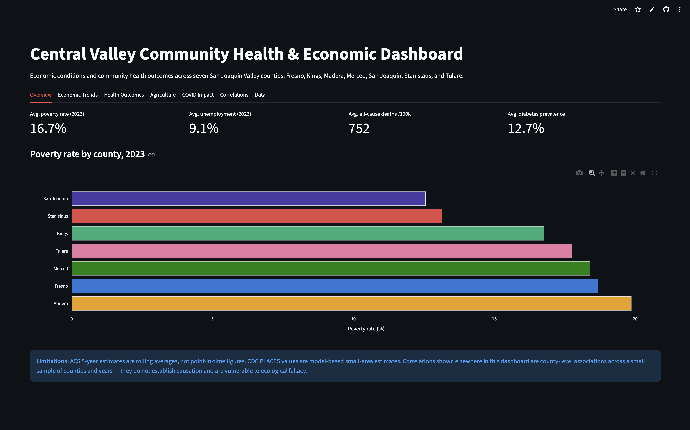
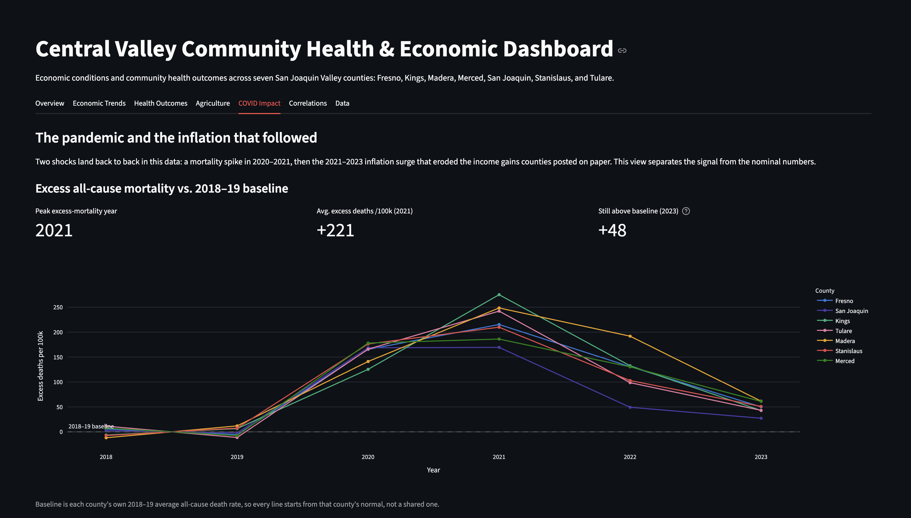
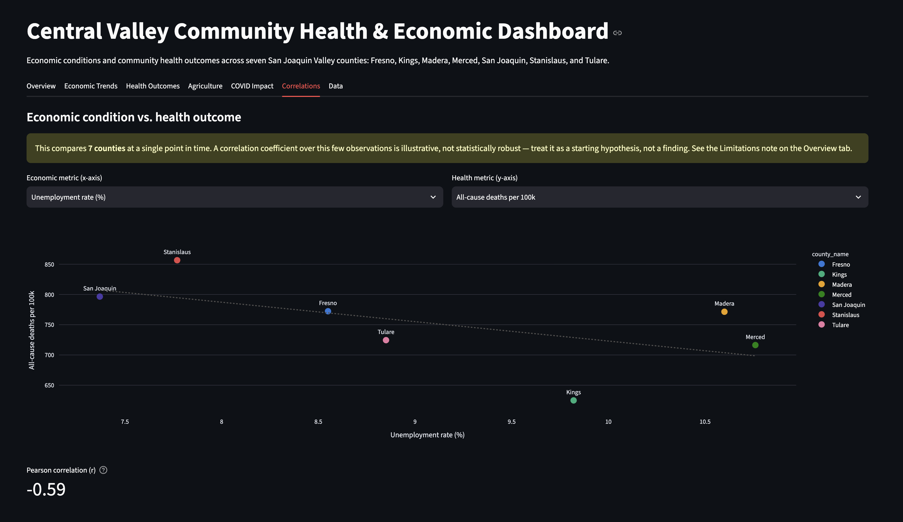

# Central Valley Community Health & Economic Dashboard

An end-to-end data pipeline and interactive dashboard examining the relationship between economic conditions and community health outcomes across seven San Joaquin Valley counties: Fresno, Kings, Madera, Merced, San Joaquin, Stanislaus, and Tulare.

Built to demonstrate production ETL design: modular extraction, validation at every transformation step, PostgreSQL storage, automated run reporting, and a Streamlit front end.



## Why this region

The Central Valley produces a large share of the nation's food while its residents face some of California's highest poverty rates and worst chronic disease burdens. This project puts economic and health data for the region side by side and quantifies the relationships between them.

## Data sources

| Source | What it provides | Access |
|---|---|---|
| US Census Bureau, ACS 5-Year | Population, income, poverty, education, housing, employment | REST API, key required |
| USDA NASS Quick Stats | Crop values, agricultural commodity data, farm economics | REST API, key required |
| CDC PLACES | Modeled county estimates of chronic disease prevalence, health behaviors, preventive care | Socrata API, no key |
| CA Health & Human Services Open Data | Health outcomes and mortality for California counties | CKAN API, no key |
| US Bureau of Labor Statistics, CPI-U | Annual inflation index, for deflating nominal income to constant dollars | Static reference table |

## Pipeline architecture

```
extract (per-source modules, retry logic, raw CSV snapshots)
   -> transform (type coercion, derived rates, quality validation)
   -> load (PostgreSQL upserts)
   -> report (summary CSV + markdown run report)
   -> dashboard (Streamlit, reads from PostgreSQL)
```

Data quality philosophy: anomalies are flagged and logged, never silently dropped. Census sentinel values are converted to NULL with each occurrence logged. Impossible values (negative counts, subgroups exceeding their universe, implausible populations) are flagged and retained so they can be audited. Every run produces a report listing all flags raised.

## Project structure

```
cv-health-dashboard/
├── src/
│   ├── config.py            # counties, FIPS codes, variables, paths
│   ├── pipeline.py          # master orchestration script
│   ├── extract/             # one module per data source
│   │   ├── census.py
│   │   ├── nass.py
│   │   ├── cdc_places.py
│   │   └── chhs.py
│   ├── transform/           # cleaning, derived metrics, validation
│   ├── load/                # PostgreSQL loaders
│   └── utils/               # shared logging, HTTP retry client
├── sql/                     # schema DDL and analysis queries
├── dashboard/               # Streamlit app
│   ├── app.py
│   └── requirements.txt     # deploy manifest (must sit beside app.py)
├── docs/images/             # README screenshots
├── data/raw/                # timestamped raw pulls (gitignored)
├── data/processed/          # cleaned outputs (gitignored)
├── reports/                 # per-run summary CSV and markdown report
├── logs/                    # per-run pipeline logs
├── tests/
├── requirements.txt         # full pipeline environment
├── .env.example
└── README.md
```

## Setup

1. Clone the repo and create a virtual environment:
   ```
   python -m venv .venv
   source .venv/bin/activate      # Windows: .venv\Scripts\activate
   pip install -r requirements.txt
   ```
2. Copy `.env.example` to `.env` and add your API keys and PostgreSQL credentials.
3. Create the database: `createdb cv_dashboard`

## Running

Run a single extraction module standalone:
```
python -m src.extract.census
```

Run the full pipeline (extraction through reporting):
```
python -m src.pipeline
```

Launch the dashboard:
```
streamlit run dashboard/app.py
```

## Dashboard views

The Streamlit app has seven tabs: an overview, economic trends, health outcomes,
agriculture, a **COVID Impact** analysis, a correlations explorer, and a raw-data
browser. Every chart uses a fixed county-to-color mapping, so a county reads as the
same color in every view.

### COVID impact

The COVID Impact tab isolates two back-to-back shocks in the data:

- **Excess mortality** — each county's all-cause death rate measured against its own
  2018–19 pre-pandemic baseline, showing the 2020–21 spike and an incomplete recovery.
  The region peaked at +221 deaths per 100k in 2021 and was still +48 above baseline
  in 2023.
- **Nominal vs. real income** — ACS median household income deflated to constant
  dollars with the BLS CPI-U, so the post-2021 inflation surge that eroded on-paper
  income gains is visible rather than hidden in nominal figures. Fresno's income rose
  39% on paper between 2018 and 2023 but only 15% in real terms.



### Correlations

Pairs any economic metric against any health outcome, with a fitted trend line and a
Pearson coefficient — deliberately framed with its own small-sample caveat, since
seven counties at one point in time is a starting hypothesis, not a finding.



## Limitations

- ACS 5-year estimates are rolling averages; adjacent vintages share underlying samples, so year-over-year changes should be read as smoothed trends, not point-in-time shifts.
- CDC PLACES values are model-based small area estimates, not direct measurements.
- Correlations shown in the dashboard are county-level associations across a small sample of counties and years. They do not establish causation and are vulnerable to ecological fallacy.
- NASS coverage varies by commodity and year; some county-commodity combinations are suppressed for disclosure protection.
- Real-income figures are deflated with the national CPI-U, not a Central Valley regional price index; local cost-of-living changes may differ from the national average.

## Status

- [x] Project scaffold, config, logging, retry client
- [x] Census ACS extraction module with validation
- [x] NASS, CDC PLACES, and CHHS extraction modules
- [x] Transform layer and PostgreSQL schema
- [x] PostgreSQL load module (idempotent upserts)
- [x] Master pipeline and automated reporting
- [x] Streamlit dashboard
- [x] COVID impact analysis (excess mortality + CPI-deflated real income)
